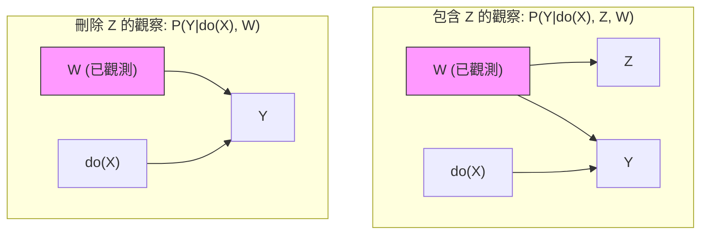
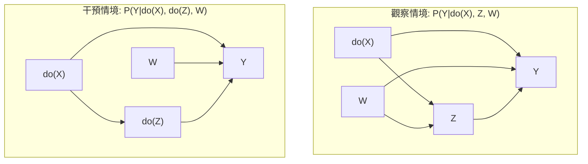
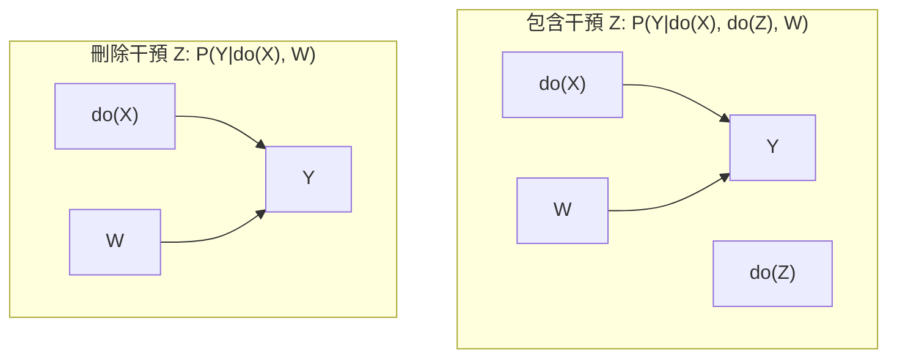

## 歷史發展

### **Phase 0：前史（1920s–1960s）— 沒有「因果推論」這個領域**

#### 當時在做什麼？

* Fisher（隨機實驗）
* Neyman（潛在結果的雛形，但沒有 causal language）
* 計量經濟學：
  * 同時方程
  * 結構模型
  * 但沒有清楚的 counterfactual 定義

#### 特徵

* 因果 = 結構模型
* 但沒有形式化「如果沒發生會怎樣」

👉 **Rubin 跟 Pearl 都還沒出現**

---

### **Phase 1：Rubin 潛在結果革命（1974–1990）**

#### 關鍵事件

* **1974：Rubin 發表「Estimating causal effects of treatments」**
* 明確提出：
  * $Y(1), Y(0)$
  * 因果效果 = 差值
  * SUTVA

#### Rubin 在解什麼問題？

> **「在非實驗資料下，什麼叫做因果效果？」**

這是當時一個**沒人解得乾淨的問題**。

#### Rubin 的策略

* 完全不碰結構
* 不碰同時方程
* 不談生成機制
* **只談設計（design）**

> If you design it like an experiment, analyze it like an experiment.

#### 社群

* 統計學
* 生物統計
* 醫學試驗

#### 對外態度

* 對「結構模型」非常不信任
* 覺得那是 unverifiable assumptions

👉 **這是 Rubin 跟經濟學、AI 分裂的起點**

---

### **Phase 2：Pearl 的 SCM 與 AI 路線（1980s–2000）**

#### 關鍵事件

* 1980s：Bayesian networks
* **2000：Pearl《Causality》第一版**

#### Pearl 在解什麼問題？

> **「機器如何推理干預、反事實與機制？」**

這跟 Rubin 解的問題**本來就不同**。

#### Pearl 的核心貢獻

* Structural equations
* DAG
* do-operator
* Backdoor / Frontdoor
* Identification as a formal problem

#### 社群

* AI
* Computer Science
* 部分經濟學理論派

#### 對 Rubin 的態度（歷史事實）

* 覺得 PO 是：
  * 記號混亂
  * 沒有識別語言
  * 只能處理簡單問題

👉 這時候 **雙方是真的彼此看不起對方**

---

### **Phase 3：全面對立期（2000–2010）**

這是你「分很開」的真正根源。

#### 狀態是什麼？

* Rubin camp：
  * 不畫 DAG
  * 不用 do-operator
  * 覺得 Pearl 是 metaphysics
* Pearl camp：
  * 覺得 Rubin 是 statistics without causality
  * 覺得 matching / regression 是 ad hoc

#### 非常關鍵的一點

**這時候，邏輯等價還沒有被系統性證明**

* Rubin 沒有完整 SCM
* Pearl 沒有清楚對應 PO estimands

👉 所以這不是誤會，而是真的「尚未接上」

---

### **Phase 4：橋接期（2010–2017）— 關鍵轉折**

#### 幾個關鍵事件

##### 1️⃣ Robins 的 G-formula / SWIG

* 把 PO 嵌入結構模型
* 明確顯示：
  * PO = SCM 的一種表達

##### 2️⃣ Imbens & Rubin（2015）

* 開始在教科書中承認 DAG 的價值
* 但仍然語言保守

##### 3️⃣ Pearl & Bareinboim

* Transportability
* Data fusion
* 這些 PO 無法單獨處理

#### 學界開始意識到

> **這不是兩套因果，而是兩種語言**

但：

* 社群仍未合流
* 審稿仍然分軌

---

### **Phase 5：ML 因果推論推動的「被迫整合」（2017–至今）**

#### 關鍵推力不是哲學，而是**工程問題**

##### DML（Chernozhukov et al.）

* 識別：來自經濟學 / SCM
* 估計：來自 PO / semiparametrics
* ML：來自 CS

👉 不整合根本做不出來

##### Causal Forest / Policy Learning

* 必須同時：
  * 定義 counterfactual
  * 確保 identification
  * 最後做 decision

#### 結果

* **邏輯層面：已經高度整合**
* **實務層面：開始混用**
* **社群層面：仍然分裂**

## **Module 1 — Structural Causal Model 的因果語言基礎**

**SCM 出現的唯一理由：**

> 傳統機率論沒有語言描述「干預」

### SCM 的核心組成

$$ 
\mathcal{M} = (U, V, F)
 $$

#### 1️⃣ 外生變數（Exogenous variables） (U)

* 不被模型內其他變數解釋
* 代表所有「背景因素」「隱含干擾」

#### 2️⃣ 內生變數（Endogenous variables） (V)

* 模型中你關心的變數
* 會被其他變數影響

#### 3️⃣ 結構方程（Structural equations） (F)

$$ 
X := f_X(\text{Parents}(X), U_X)
 $$

### Intervention（干預）vs Observation（觀察）

#### Observation（觀察）

$$ 
P(Y \mid X=x)
 $$

* X 是自然生成的
* X 可能攜帶 confounding information

#### Intervention（干預）

$$ 
P(Y \mid do(X=x))
 $$

* 強制 X = x
* 切斷 X 的生成方程
* 不再受其原本父節點影響

👉 **do() 不是條件機率，是世界被改寫**

這是 SCM 語言能做、PO 與傳統統計無法「原生」表達的事。

### SCM 的隱含公理

* **Modularity (Invariance Principle)**：當我干預其中一個變數 $X$ 時，只有 $X$ 的方程被改變，系統中其他的方程（機制）保持不變。這是預測「從未發生過的政策效果」的前提。
* **Consistency (一致性)**：如果我們干預 $X$ 令其等於它在觀察中本來就會呈現的值 $x$，那麼觀測到的 $Y$ 就應該等於干預後的 $Y$。即：$X=x \implies Y_x = Y$。

### SCM 在「三件事」中的角色

#### ✅ Identification

* SCM 是 **識別語言**
* 問的是：
  * 這個 causal query 是否可由 observable data 表達？

#### ⚠️ Estimation

* SCM **不負責估計**
* 但給出 estimand（如 g-formula）

#### ✅ Application

SCM 特別擅長：

* Mediation / mechanism
* Transportability
* Causal discovery
* Counterfactual reasoning

## **Module 2 — DAG 與因果結構表達**

### DAG 的正式定義（語義層）

一張 DAG 是：

* Directed
* Acyclic
* Graph on variables (V)

#### 語義核心（這句話很重要）：

> **DAG 編碼了 SCM 中「哪些變數出現在哪些結構方程的右邊」**

也就是：

$$ 
X := f_X(\text{Parents}(X), U_X)
 $$

#### 因果結構的三大基本原子 (Atoms)

所有的複雜因果圖，都是由這三種基本結構組成的：

##### **A. 鏈條結構 (Chain / Mediator): $X \to M \to Y$**

* **物理意義**：$X$ 透過中介變數 $M$ 影響 $Y$。
* **相關性**：$X$ 與 $Y$ 相關。
* **阻斷**：如果我們**控制（Condition on）** $M$，$X$ 與 $Y$ 之間的資訊流就被切斷了（$X \perp\!\!\perp Y \mid M$）。

##### **B. 分叉結構 (Fork / Confounder): $X \leftarrow C \to Y$**

* **物理意義**：$C$ 是 $X$ 與 $Y$ 的共同原因。
* **相關性**：$X$ 與 $Y$ 之間存在「偽相關」（Spurious Correlation）。
* **阻斷**：如果我們控制 $C$，$X$ 與 $Y$ 就會變得獨立（$X \perp\!\!\perp Y \mid C$）。

##### **C. 對撞結構 (Collider): $X \to Z \leftarrow Y$**

* **物理意義**：$X$ 與 $Y$ 是獨立的，但它們共同導致了 $Z$。
* **相關性**：$X$ 與 $Y$ 本來**不相關**。
* **驚人的特性**：如果你**控制**了對撞因子 $Z$（或 $Z$ 的後代），反而會**開啟** $X$ 與 $Y$ 之間的路徑，讓原本無關的兩者變得相關。這就是著名的 **「伯克森悖論」(Berkson's Paradox)**。

#### d-separation (有向分離)

這是 Pearl 框架中最天才的設計。它是一套純粹的**圖形化規則**，用來判斷兩組變數在給定一組觀測值的情況下，是否**條件獨立**。

**d-separation 的規則（如何阻斷路徑）：**

1. **路徑中有 Chain ($A \to B \to C$) 或 Fork ($A \leftarrow B \to C$)**：控制中間節點 $B$，路徑即阻斷。
2. **路徑中有 Collider ($A \to B \leftarrow C$)**：
    
    * **不控制** $B$（且不控制 $B$ 的後代）：路徑是阻斷的。
    * **一旦控制** $B$（或其後代）：路徑就被「開啟」。

> **結論**：如果 $X$ 與 $Y$ 之間所有的路徑都被阻斷，我們稱 $X$ 與 $Y$ 是 **d-separated**，對應到數據上，它們就是獨立的。

### Markov Equivalence Class（為何 DAG 不唯一）

例子：

$$ 
X \rightarrow Y \rightarrow Z
 $$

與

$$ 
X \leftarrow Y \rightarrow Z
 $$

如果沒有 collider，CI 結構一樣。

👉 這解釋了：

* 為什麼 causal discovery 需要額外假設
* 為什麼因果不是純統計

## **Module 3 — do-operator 與介入邏輯**

* $X=x$：世界自然發生
* $do(X=x)$：我強制改寫世界

### do(X=x) 在 SCM 裡到底做了什麼？

回到 Module 1 的 SCM：

$$ 
X := f_X(\text{Parents}(X), U_X)
 $$

#### do(X=x) 的定義是：

* **刪掉** X 的原本結構方程
* **直接指定** (X=x)
* 其他結構方程保持不變（modularity）

### Backdoor Criterion（第一個識別定理）

#### 問題設定

你有一張 DAG，關心：

$$ 
X \rightarrow Y
 $$

#### Backdoor path 是什麼？

任何：

* 從 X 到 Y
* **第一步是指向 X 的路徑**

代表：

* 由共同原因產生的虛假關聯

---

#### Backdoor Criterion（語義版）

一組變數 (Z) 滿足：

1. 阻斷所有 X → Y 的 backdoor paths
2. (Z) 不包含 X 的 descendant

👉 則：

$$ 
P(Y \mid do(X=x)) = \sum_z P(Y \mid X=x, Z=z)P(Z=z)
 $$

---

#### 你應該注意的三個重點

1. 這不是「控制所有變數」
2. 控制 collider 會破壞 backdoor
3. 有時「什麼都不控制」才是正確的

### Frontdoor Criterion（反直覺但關鍵）

#### 為什麼需要 frontdoor？

因為有時：

* X → Y 被 unobserved confounder 污染
* Backdoor 無解

---

#### Frontdoor 設定

$$ 
X \rightarrow M \rightarrow Y
 $$

同時：

* U → X
* U → Y

但：

* X → M 沒有 confounder
* M → Y 在控制 X 後沒有 confounder

---

#### Frontdoor Identification（直覺版）

把因果拆成兩段：

1. X 對 M 的影響（可識別）
2. M 對 Y 的影響（在控制 X 後）

然後「重新組合」。

👉 這是**結構推理**，不是統計技巧

### do-calculus 的三條公理 (The Three Axioms)

這是 Judea Pearl 的最高成就。這三條規則告訴你，在什麼圖形條件下，你可以移動或刪除 $do$ 算子。

#### **規則 1：觀察的插入與刪除 (Insertion/Deletion of observations)**

如果在刪除指向 $X$ 的箭頭後，$Y$ 與 $Z$ 在給定 $X$ 和 $W$ 的條件下是 d-separated 的：

$$P(Y|do(X), Z, W) = P(Y|do(X), W)$$

* **直覺**：如果 $Z$ 對 $Y$ 沒貢獻，有沒有看到 $Z$ 都不影響我們對干預效果的估計。

#### **規則 2：干預與觀察的交換 (Action/Observation exchange)**

如果在刪除指向 $X$ 的箭頭並刪除從 $Z$ 指出的箭頭後，$Y$ 與 $Z$ 在給定 $X$ 和 $W$ 的條件下是 d-separated 的：

$$P(Y|do(X), do(Z), W) = P(Y|do(X), Z, W)$$
	 
* **直覺**：這就是著名的**後門準則 (Backdoor Criterion)** 的代數基礎。如果路徑被阻斷，那麼「去做 $Z$」和「看到 $Z$」的效果是一樣的。

#### **規則 3：干預的插入與刪除 (Insertion/Deletion of actions)**

如果在 $Y$ 與 $Z$ 之間沒有任何因果路徑（在特定的修改圖中）：

$$P(Y|do(X), do(Z), W) = P(Y|do(X), W)$$

* **直覺**：如果 $Z$ 與 $Y$ 之間沒有任何因果連繫，那麼對 $Z$ 進行干預完全不會影響 $Y$。

## **Module 4 — Identification in SCM：什麼因果問題「可解」？**

### Identification 是什麼 & 不是什麼

#### 正確定義

> **Identification =
> 在已知因果結構（DAG）下，
> 因果量是否能唯一地由 observational distribution 決定**

#### 不是什麼

* ❌ 不是估計準不準
* ❌ 不是統計顯不顯著
* ❌ 不是資料夠不夠多

即使：

* 無限樣本
* 完美模型

**不可識別 = 永遠算不出來**

---

### 識別問題的三個輸入

任何識別問題，固定由三樣東西決定（MECE）：

1. **因果結構**（DAG / SCM）
2. **可觀測變數集合**
3. **目標因果量**（ATE, CATE, mediation, policy）

只要其中一樣改變，識別結論就可能改變。

### 識別方法總地圖

| 類型             | 是否需調整 | 是否允許 unobserved confounder | 能解什麼              |
| -------------- | ----- | -------------------------- | ----------------- |
| Backdoor       | 是     | 否                          | ATE               |
| Frontdoor      | 否     | 是                          | ATE               |
| IV             | 否     | 是                          | LATE              |
| Mediation      | 視情況   | 視結構                        | Direct / Indirect |
| Functional     | 否     | 是                          | 模型依賴              |
| Counterfactual | 否     | 是                          | 個體反事實             |
| Transport      | 視結構   | 視情況                        | 跨環境               |

## **Module 5 — Mediation 與因果機制（SCM 強項）**

### 1. Direct vs. Indirect Effects (直接與間接效應)

在存在中介變數 $M$ 的結構中：$X \to M \to Y$ 且 $X \to Y$。

* **直接效應 (Direct Effect)**：$X$ 繞過 $M$ 直接對 $Y$ 產生的物理影響。
* **間接效應 (Indirect Effect)**：$X$ 透過改變 $M$，進而導致 $Y$ 變化的那部分影響。
* **傳統的挑戰**：在非線性模型中（例如邏輯迴歸），總效應並不等於直接效應與間接效應的簡單相加。SCM 透過反事實語義完美解決了這個問題。

---

### 2. Controlled vs. Natural Effects (受控與自然效應)

這是 Pearl 對中介分析最重大的貢獻，區分了兩種不同的干預邏輯：

#### **A. Controlled Direct Effect (CDE, 受控直接效應)**

* **定義**：將 $M$ 強行固定在某個特定值 $m$ 時，$X$ 從 $x$ 變到 $x'$ 對 $Y$ 的影響。
* **公式**：$CDE(m) = P(Y|do(x), do(m)) - P(Y|do(x'), do(m))$。
* **直覺**：如果我們強行讓所有人的血壓（中介項）都保持在正常值，吸菸對壽命還有多少影響？

#### **B. Natural Direct Effect (NDE, 自然直接效應)**

* **定義**：當 $X$ 從 $x$ 變到 $x'$ 時，讓 $M$ 保持在 **「如果 $X$ 沒有變化時，它本來會呈現的那個值」**，此時 $Y$ 的變化。
* **公式**：$NDE = E[Y_{x', M(x)} - Y_{x, M(x)}]$。
* **直覺**：這是一種更細膩的反事實。它問的是：如果我們切斷 $X \to M$ 的聯繫，只看 $X$ 本身的變動，效果是多少？

#### **C. Natural Indirect Effect (NIE, 自然間接效應)**

* **定義**：保持 $X$ 固定不變，但將 $M$ 的值從「$X=x$ 時的自然值」變為「$X=x'$ 時的自然值」，此時 $Y$ 的變化。
* **直覺**：這完全分離出了「路徑」的貢獻。

### 3. Interventional Effects（新一代替代方案）

為了解決 cross-world 問題，提出：

* Interventional Direct Effect
* Randomized Interventional Analogs

#### 特點

* 不用 cross-world
* 語義接近政策
* 更容易識別

👉 這是近十多年 mediation 文獻的主流方向

## **Module 6 — Causal Discovery（因果結構學習）**

### Discovery 問題的形式化定義

#### 輸入

* Observational data
* 一組假設（CI、functional form、noise）

#### 輸出

* 一個 DAG？
* ❌ 不對
* **一個等價類（Markov equivalence class）**

通常表示為：

* CPDAG
* PAG（若允許 latent confounders）

### 1. Constraint-based Methods (基於約束的方法)

這類方法的核心思想是利用數據中的 **條件獨立性 (Conditional Independence)** 來推斷圖結構。

* **PC Algorithm (Spirtes & Glymour)**：
    * **邏輯**：從全連接圖開始，利用統計檢定（如 Fisher-Z）不斷刪除獨立的邊，找回骨架 (Skeleton)，然後利用 **v-structures**（對撞結構）來確定箭頭方向。
    * **產出**：通常是一個 **CPDAG (合模式有向無環圖)**，即它能告訴你哪些邊是確定的，哪些邊的方向在邏輯上是等價的。
* **FCI (Fast Causal Inference)**：
    * **進階之處**：PC 算法假設沒有「未觀測的干擾項」。FCI 則放寬了這個假設，它能處理存在 **Latent Confounders** 的情況。
    * **產出**：一個 **PAG (部分祖先圖)**，它能區分「A 是 B 的原因」與「A 和 B 之間存在共同原因」。

---

### 2. Score-based Methods (基於評分的方法)

這類方法將結構尋找視為一個 **優化問題**。

* **GES (Greedy Equivalence Search)**：
    * **邏輯**：定義一個評分函數（如 **BIC** 或 **BDeu**），衡量圖結構對數據的解釋力與複雜度的平衡。演算法在「馬可夫等價類」的空間中進行貪婪搜索（增加邊或刪除邊）。
    * **特點**：通常比 PC 算法更穩健，尤其在處理有限樣本數據時。

---

### 3. Functional Causal Models & Assumptions (功能性假設)

這是近 15 年來最突破性的進展。它證明了：**如果我們對噪聲 (Noise) 的分佈做一些假設，我們就能突破馬可夫等價類的限制，辨別方向。**

* **LiNGAM (Linear Non-Gaussian Acyclic Model)**：
    * **核心假設**：
        
        1. 變數間是線性關係。
        2. **噪聲服從非高斯分佈 (Non-Gaussian)**。
            
    * **震撼結論**：在非高斯假設下，因果方向是具備 **不對稱性** 的。透過獨立成分分析 (ICA)，我們可以唯一地確定整個 DAG，而不再只是等價類。
* **Additive Noise Models (ANM)**：
    * 假設 $Y = f(X) + E$。如果 $E$ 與 $X$ 獨立，但在反方向 $X = g(Y) + E'$ 中 $E'$ 與 $Y$ 不獨立，我們就能斷定 $X \to Y$。這在處理非線性關係時非常強大。

## **Module 7 — Transportability 與 External Validity**

### 正式問題定義

給定：

* Source domain：有實驗或觀測資料
* Target domain：只有觀測資料
* Selection diagram

問：

$$   
P^*(Y \mid do(X=x))  
 $$  

能否由：

* Source 的 $P(Y \mid do(X))$
* Target 的 $P^*(\cdot)$

組合得到？

---

### Transport Formula（核心結果）

如果可 transport：

$$   
P^{*}(Y \mid do(X)) = \sum_z P(Y \mid do(X), z) P^{*}(z)  
$$

#### 重點不是公式，是結構條件

這個式子成立 **不是因為統計性質**，
而是因為：

* Z 的機制在兩個環境不變
* X → Y 的因果結構不變

### Data Fusion (數據融合)

這是因果推論的「大一統」願景。

* **核心思想**：現實中，我們往往有許多碎片的數據。
    * 數據 A：樣本量大，但只是觀察數據（有偏差）。
    * 數據 B：實驗數據（RCT），但樣本量極小。
    * 數據 C：來自不同城市的數據。
* **SCM 的解決方案**：利用數據融合演算法，將這些來源不同的資訊整合進同一個結構圖中，算出一個比任何單一數據源都更準確、更具推廣性的因果估計。

### Multi-environment Causality (多環境因果)

這在當前的 **Causal AI** 領域非常火紅。

* **不變性原則 (Invariance Principle)**：如果一個因果關係是真正的物理機制（如：$F = ma$），那麼它在任何環境下都不應該改變。
* **應用**：透過觀察數據在多個不同環境（Environments/Domains）中的變動，我們可以反向識別出哪些特徵是真正的「因果特徵」，哪些只是在特定環境下才成立的「偽特徵」。這能極大提升機器學習模型的 **OOD (Out-of-Distribution) 魯棒性**。

## **Module 8 — 從 SCM 到估計：為什麼這裡要交棒？**

SCM 的三個核心輸出：

1. **可識別 or 不可識別**
2. **Estimand（形式化因果量）**
3. **對應的結構假設集合**

SCM **沒有**輸出：

* estimator
* 標準誤
* 收斂速度
* 小樣本性質

### g-formula：SCM 的終點

這由 Jamie Robins 提出，後來被 Pearl 整合進 SCM。它是所有因果估計的母體公式。

* 定義：當我們通過後門準則確定了調節變數集 $Z$ 後，$P(y|do(x))$ 的計算方式即為：

    $$P(y|do(x)) = \sum_{z} P(y|x, z) P(z)$$

* **物理意義**：這被稱為 **「標準化 (Standardization)」**。
* **運作邏輯**：
    
    1. 在 $Z$ 的每一個層級（例如：不同年齡組）觀察 $X$ 與 $Y$ 的關係。
    2. 將這些關係按照 $Z$ 在全體人口中的分佈進行加權平均。
        
* **地位**：它是「非參數」的。它不假設線性，不假設正態。它是所有迴歸、匹配模型的靈魂。

### 與統計工具的連結

g-formula 只是理論表達式，在實務操作中，它會演變成我們熟悉的工具：

* **與迴歸 (Regression) 的連結**：
    * 如果我們假設 $P(y|x, z)$ 是線性的，那麼 $y = \alpha + \beta x + \gamma z + \epsilon$ 中的 $\beta$ 就是 g-formula 的解。
    * **SCM 的視角**：迴歸只是實現 g-formula 的一種「參數化」手段。
* **與逆機率加權 (IPW) 的連結**：
    * 透過貝氏定理，g-formula 可以改寫為：

        $$P(y|do(x)) = E \left[ \frac{I(X=x) Y}{P(X|Z)} \right]$$

    * **物理意義**：這就是 IPW 的來源。它告訴我們，與其對 $Y$ 建模，不如對 $X$（處理項的機率，即 Propensity Score）建模。
