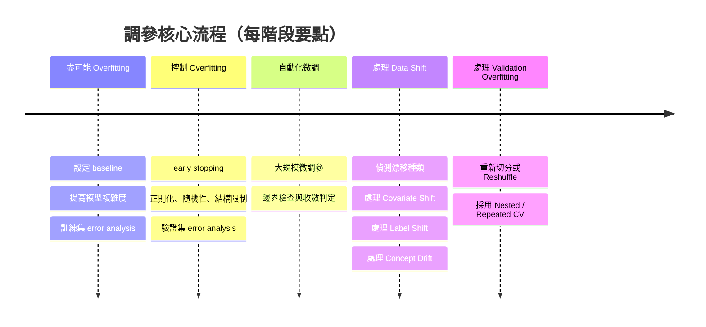
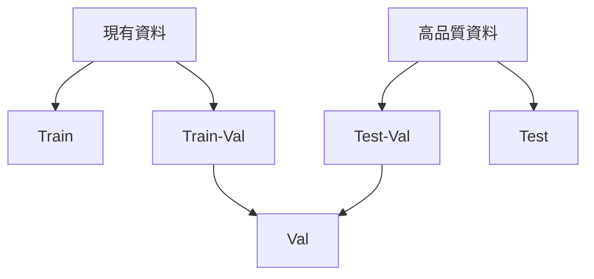
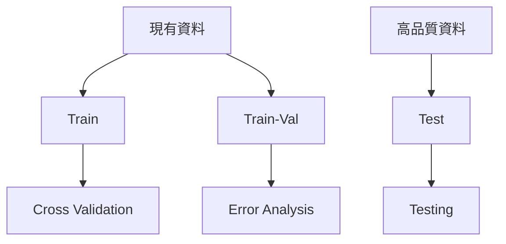
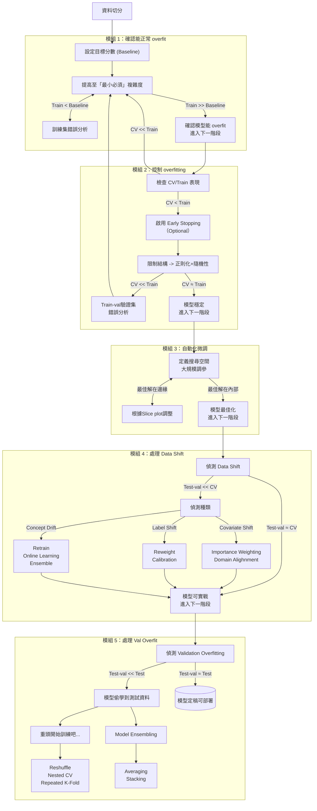

## 零、背景知識

### 調參的最終目的與誤差來源

機器學習模型調參的最終目的，就是**降低模型在從未見過的測試集（Testing Set）上的誤差**。

要有效地降低這個最終誤差，我們必須先理解誤差從何而來。在實務中，一個模型的總測試誤差（Test Error）可以概念性地拆解為五個來源：

$$\text{Test Error} = \text{Irreducible Error} + \text{Bias} + \text{Variance} + \text{Data Shift} +\text{Validation Overfitting}$$

我們的調參工作，就是一場針對後四個「可控誤差」的戰爭。

| **誤差來源**                   | **問題本質**              | **對應的調參方向**   |
| -------------------------- | --------------------- | ------------- |
| **Bias（偏差）**               | 模型太簡單，學不會資料中的規律。      | 增加模型複雜度       |
| **Variance（變異）**           | 模型太複雜，連資料中的噪聲都學進去了。   | 降低模型複雜度       |
| **Data Shift（資料漂移）**       | 訓練和測試的「遊戲規則」不同。       | 調整資料權重或校正資料分佈 |
| **Validation Overfitting** | 過度依賴單一驗證集，導致調參結果「作弊」。 | 改善評估流程        |

### 實務資料切分

要準確地診斷並對抗上述誤差，我們必須先建立一個可靠的「評估戰場」。這需要一套嚴謹的資料切分策略，尤其要考慮到**訓練資料來源**（量大、易取得、可能較舊）和**測試資料來源**（量少、昂貴、但最貼近真實場景）在分佈上可能根本不同，我們將資料切分為以下四個核心集合：

| **資料集合**                   | **來源** | **主要用途**                                                                |
| -------------------------- | ------ | ----------------------------------------------------------------------- |
| **`Train Set`** (訓練集)      | 訓練資料來源 | **用於 K-Fold 交叉驗證 (CV)**。這是對抗 `Bias` 和 `Variance` 的主戰場。                  |
| **`Train-Val Set`** (分析集)  | 訓練資料來源 | **完全保留，不參與訓練/CV**。用於「模型分析」（如 SHAP, Error Analysis）。                     |
| **`Test-Val Set`** (漂移監測集) | 測試資料來源 | **監測 `Data Shift`**。用 CV 選出的最佳模型在此評估，看分數下降多少。                           |
| **`Test Set`** (最終守門集)     | 測試資料來源 | **~~只用一次~~ ，不能作為調參、選模型的依據**。用於評估最終模型的「泛化能力」與「`Validation Overfitting`」。 |

#### 深度學習抽樣

#### 機器學習抽樣

### 使用 Score Gap 診斷誤差

這四個集合上的模型表現（我們稱為 Score）能幫我們精準定位問題：

| **比較的 Gap**                      | **主要診斷的誤差**                | **說明**                                                   |
| -------------------------------- | -------------------------- | -------------------------------------------------------- |
| Train Score vs. Target (業務/人類目標) | **Bias (偏差)**              | Train Score 距離我們的業務目標或人類水平還很遠，代表模型容量不足。                  |
| Train Score vs. CV Score         | **Variance (變異)**          | Train Score 遠高於 CV Score，代表模型過擬合了訓練資料的噪聲。                |
| CV Score vs. Test-Val Score      | **Data Shift (資料漂移)**      | CV Score 遠高於 Test-Val Score，代表模型無法泛化到真實世界的分佈。            |
| Test-Val Score vs. Test Score    | **Validation Overfitting** | Test-Val Score 明顯高於 Test Score，代表調參流程過度迎合了 Test-Val Set。 |

### 實戰藍圖：五步調參法

1. **盡可能 overfitting**
    
2. **控制 overfitting**
    
3. **自動化微調**
    
4. **處理 Data Shift**
    
5. **處理 Validation Overfitting**

## 一、盡可能 overfitting

我們首先要刻意地讓模型在訓練集上達到近乎完美的表現（例如 100% 準確率或 0.0 RMSE），此時**完全忽略**驗證集（`CV Score`）的表現，目的是:

1. **確保模型足夠複雜：** 如果你的模型在「移除所有限制」後，依然無法在訓練集上拿到高分，這意味著模型太簡單了（`Bias` 過高）。無論你後續如何正則化，一個連題目都看不懂的學生，是不可能考高分的。同時這也是確保模型是運作正常，真的可以從訓練資料中學會一些東西。
    
2. **建立「複雜度天花板」：** 這一步能幫我們找到「能讓模型達到 100% 訓練表現的**最小成本**」。例如，如果我們發現用 500 棵樹 (`n_estimators=500`) 就能讓 `Train Score` 達到完美，我們就**再也不需要**在後續的調參中嘗試 4000 棵樹。

### 步驟 1.1：設定你的「目標分數」 (Baseline)

在我們開始強迫模型 overfit 之前，我們需要一個「標竿」，告訴我們「完美」的定義是什麼，以及我們的模型（在訓練集上）至少應該達到什麼水平。此時目標是讓 Train Score 遠遠超過這個 baseline，最好是趨近完美 (例如 1.0)。

| **Baseline 來源** | **範例**                                                                                                    | **在本章的意義**                                                                                |
| --------------- | --------------------------------------------------------------------------------------------------------- | ----------------------------------------------------------------------------------------- |
| **1. 簡單模型**     | <li> **Regression:** `BayesianRidge` 或 `LinearRegression`。 <li> **Classification:** `LogisticRegression`。 | 這是你的**最低門檻**。如果你的 GBDT `Train Score` 連 `BayesianRidge` 的 `Train Score` 都打不過，代表模型或特徵有嚴重問題。 |
| **2. 商業目標**     | <li> 「目前線上的舊系統準確率為 80%。」 <li> 「業務方要求錯誤率必須低於 5%。」                                                          | 這是**可接受的門檻**。你的 `Train Score` 必須能輕易超越它。                                                   |
| **3. 人類表現**     | <li> 「領域專家（如醫生）的判斷準確率為 98%。」                                                                              | 這是**理論上的天花板**。你的 `Train Score` 應該要能夠達到或超越這個水平，以證明模型容量是足夠的。                                |

### 步驟 1.2：移除剎車油門踩到底

這裡以 GBDT 模型為例，為了系統性地達到這個目的，步驟和關鍵參數整理如下表：

| **步驟**               | **目標**                                 | **關鍵參數 (以 LightGBM 為例)**                                                                              | **調整指引**                                                                                                                                                                                                                  |
| -------------------- | -------------------------------------- | ----------------------------------------------------------------------------------------------------- | ------------------------------------------------------------------------------------------------------------------------------------------------------------------------------------------------------------------------- |
| **Step 1: 移除所有限制**   | 確保模型不受任何正則化或早停的干擾，可以全力學習。              | `lambda_l1` `lambda_l2` `min_gain_to_split` `min_child_samples` `feature_fraction` `bagging_fraction` | 全部設為 0 或 1.0 (關閉效果)。 例如：`lambda_l1=0`, `lambda_l2=0`, `feature_fraction=1.0`。                                                                                                                                             |
|                      |                                        | `early_stopping_rounds` (早停)                                                                          | **不要**在 `fit` 或 `cv` 中設置此參數。                                                                                                                                                                                              |
| **Step 2: 提升基礎容量**   | 找到能讓模型收斂到最佳訓練表現的「迭代次數」與「學習率」組合。        | `learning_rate` (學習率) `n_estimators` (樹的數量)                                                           | 這是你的**主要油門**。 1. 先固定 `learning_rate` (如 0.1)。 2. 激進地增加 `n_estimators` (如 1000, 2000, 5000)，直到 `Train Score` 飽和或趨近完美。 3. 如果 `n_estimators` 已經非常大但仍無法收斂，可以**適度降低 `learning_rate`** (如 0.05)，並搭配**更大的 `n_estimators`** 再次嘗試。 |
| **Step 3: 提升單棵樹複雜度** | 當步驟 2 的 `Train Score` 仍未達標時，增加每棵樹的複雜度。 | `max_depth` (樹深) `num_leaves` (葉節點數)                                                                  | 這是你的**次要油門**。  1. 逐步增加這兩個值。`num_leaves` 通常應小於 $2^{\text{max\_depth}}$。  2. **(重點)** LightGBM 對 `num_leaves` 非常敏感；XGBoost / CatBoost 則主要控制 `max_depth`。                                                              |

在這裡我們需要測試各種超參數的不同組合，以找到「容量天花板」，這個過程也可以透過 Optuna 來輔助，但要注意**使用的採樣器 (Sampler)**。此階段的目標不是找到「最佳解」，而是「**快速、乾淨地比較幾個特定值的表現**」，因此應該要: 先使用 GridSampler 找出目標的範圍，再使用 RandomSampler 更細緻的調整（或是單純使用 GridSampler 比較簡單易行）。

| **採樣器 (Sampler)**          | **用途**                     | **優點**                                                               | **缺點**                                                                                       |
| -------------------------- | -------------------------- | -------------------------------------------------------------------- | -------------------------------------------------------------------------------------------- |
| **`GridSampler`** (網格搜索)   | **優先使用**。當你想測試確切的超參數組合時使用。 | 精確控制。能確保 Optuna **一定會**跑你指定的 `n_estimators=[500, 1000, 2000, 3000]`。 | 最佳解很可能不在你設定的網格點上。                                                                            |
| **`RandomSampler`** (隨機搜索) | **後續使用。**當搜索空間很大時。         | 覆蓋率較廣，比網格搜索更可能「意外」碰到好解。                                              | **無法**保證一定會跑到指定的超參數值。並且在**平行化**訓練時要注意可能會重複跑到相同超參數組合。                                         |
| **`TPESampler`** (預設)      | **不建議使用。** 應用於之後的「最佳化」。    | 會「聰明地」朝著分數好的區域搜索。                                                    | **不適用於本章**。因為通常 objective 函數 return 的會是 cv score，所以用此 sampler 反而比較難達到這裡想要 overfitting 的主要目標。 |

過程中，可以使用 mlflow 的服務確認如何進一步調整:

![[截圖 2025-10-30 上午9.20.47.png]]

注意，雖然這一部分要盡可能將模型變得更複雜，但是不能一次調太複雜，而是應該一步步變愈來愈複雜，因為過於複雜的模型後續會無法控制 overfitting。舉例來說，直接將 `n_estimators = 10b` 一定能變超級複雜，但是由於過於複雜，會導致後續正則化、隨機性無法造成影響。

### 步驟 1.3：如果 Train Score 無法達標怎麼辦？

如果你已經完成了上述步驟，但 `Train Score` 依然遠低於目標。代表此時問題已不在參數，而在於**資料和特徵**。這時應立刻停止調參，轉而進行「**錯誤分析 (Error Analysis)**」。具體來說，在 **`Train Set`**（當前訓練的資料）上進行分析，找出模型「學不好」的樣本，目的在於：

1. **檢視資料品質：**

	- 找出錯誤標註（Mislabels）或需要清理的噪聲。 $\rightarrow$ 進行逐筆修正。
	- 找出潛在的異常值（Outliers）$\rightarrow$ 看是否要特別標示出來或是排除掉。
    
2. **指導特徵工程：**
    
    - 模型在哪些「子群體」上表現特別差？（例如：對某個類別的商品預測全錯） $\rightarrow$ 或許需要針對該類別建立新特徵。
    - 哪些特徵之間似乎存在模型沒學到的關係？（例如：價格高 _且_ 評分低的商品） $\rightarrow$ 可以嘗試加入交乘項特徵 (Interaction Features)。

### 本章小結

當你完成這一步時，你應該得到一組「油門踩到底」的參數。這組參數本身**不是一個好模型**（它在 `CV Score` 上會表現極差），但它是我們進入下一步「控制 Overfitting」的**關鍵起點**，我們知道接下來只需要不斷踩剎車就好，不用再擴大模型。

## 二、控制 overfitting

這一步的目標很明確：**縮小 `Train Score` 和 `CV Score` 之間的巨大鴻溝**。我們希望 `Train Score` 適度下降，並讓 `CV Score` 大幅提升。

### 步驟 2.1：開始前的檢查

雖然剛剛第一步的目的就是要盡可能達到 overfitting，因此完全不管 `CV Score` 的表現，但是如果，後者表現真的太爛的話，接下來就算再怎麼控制 overfitting，也無法獲得多好的表現。以下是實務上用來判斷是否表現太爛的經驗法則：

#### 判斷法則一：Val/Train 效能比例

這是一個最通用的指標，適用於所有分數越高越好的指標（如 AUC, $R^2$, Accuracy）。

$\text{Val/Train Ratio} = \frac{\text{CV Score}}{\text{Train Score}}$

|**Val/Train Ratio**|**診斷**|**潛在問題**|
|---|---|---|
|`Ratio` $\ge$ 0.9|泛化良好|輕微過擬合 (High Variance)|
|0.8 $\le$ `Ratio` < 0.9|明顯過擬合|`Variance` 過高 (High Variance)|
|`Ratio` < 0.8|幾乎無泛化能力|**資料/特徵問題 (High Bias)**|

#### 判斷法則二：特定指標的絕對差距

對於不同任務，我們可以觀察特定指標的「絕對差距」：

|**任務類型**|**指標 (Metric)**|**差距 (Gap) 範例**|**診斷**|
|---|---|---|---|
|**Classification**|ROC AUC|`Train`=1.0, `CV`=0.85 (Gap=0.15)|`Variance` 過高|
||ROC AUC|`Train`=1.0, `CV`=0.65 (Gap=0.35)|**特徵不足/資料問題**|
||Logloss|`CV` 比 `Train` 高 > 30%|`Variance` 過高或**特徵不足**|
|**Regression**|$R^2$|`Train`=0.95, `CV`=0.75|`Variance` 過高|
||$R^2$|`Train`=0.95, `CV`=0.50|**特徵不足/資料問題**|
||$R^2$|`Train`=0.95, `CV` < 0|**模型完全學到噪聲**|

#### 下一步行動

根據以上分析，你現在面臨兩種情況：

| **診斷 (Diagnosis)**                 | **判斷基準 (Criteria)**                                         | **下一步行動 (Next Step)**                                                                                       |
| ---------------------------------- | ----------------------------------------------------------- | ----------------------------------------------------------------------------------------------------------- |
| **`Variance` 過高** (High Variance)  | `Val/Train Ratio` > 0.8 (例如 `Train AUC`=1.0, `CV AUC`=0.85) | **✅ 可以開始！** 這是最健康的狀態。模型學到了規律，但也學了太多噪聲。**進入下一節**，引入 Early Stopping 和正則化。                                     |
| **資料/特徵問題** (Data/Feature Problem) | `Val/Train Ratio` < 0.8 (例如 `Train AUC`=1.0, `CV AUC`=0.65) | **❌ 立刻停止！** 特徵僅供「背誦」，不具「泛化」能力。此時加入正則化就算能讓 `CV` 分數變好，程度也有限。**回到步驟 1**，在 `Train-Val Set` 上進行錯誤分析，加入真正有預測力的特徵。 |

### 步驟 2.2：啟用 Early Stopping — 最優先的剎車

這是 GBDT 模型中**最重要、CP 值最高**的控制手段。它能自動找到最佳的迭代次數，防止模型無止盡地「學下去」。僅僅這一步，通常就能解決 80% 的過擬合問題。

但是實際上，有可能會因此得出跟前一步差異非常多的結果，並且有時多跑一點確實可能得到更好的結果，因此個人不建議使用，或者說與其當作主要調參的工具，不如只作為控制時間成本的方法就好，只在希望不要多浪費時間訓練模型時使用。

### 步驟 2.3：引入限制 — 精細調校剎車皮

在啟用了 Early Stopping (步驟 2.1) 的基礎上，我們現在要進一步「限制」模型在 _每一棵樹_ 上的學習能力。我們**不會**去調降 Step 1 找到的「容量天花板」（如 `num_leaves`），那是「走回頭路」。相反地，我們要做的是增加「限制」，主要可以被分為三類：

1. **結構限制 (Structural Constraints):** 過設定「硬規則」來**提早停止樹的生長**，如節點上的樣本數太少、切分帶來的資訊增益太低。
        
2. **正則化 (Regularization):** 主動懲罰那些會產生「極端權重」或「過多葉節點」的切分，這是一種更「平滑」的限制，引導模型去尋找更「保守」的解。
        
3. **隨機性 (Stochasticity):** 透過隨機抽樣資料和特徵，我們「強迫」每一棵樹成為一個「偏才」，最後再將它們組合起來，以降低整體的 `Variance`。

| **分類**   | **參數 (LightGBM)**   | **調整方向 (範例)**                | **作用 (Effect)**                                     |
| -------- | ------------------- | ---------------------------- | --------------------------------------------------- |
| **結構限制** | `min_child_samples` | 增加 (e.g., `10`, `20`, `50`)  | **(最重要)** 葉節點的最小樣本數。防止樹切分得過細，是控制過擬合的**強力**手段。       |
| **結構限制** | `min_gain_to_split` | 增加 (e.g., `0.1`, `0.5`, `1`) | 執行切分所需的「最小資訊增益」。小於此值的切分將被捨棄，能有效剪枝。                  |
| **正則化**  | `lambda_l2`         | 增加 (e.g., `0.1`, `1`, `10`)  | **(最常用)** L2 正則化。使葉節點的權重平滑，**降低權重波動**，防止模型過度依賴單一特徵。 |
| **正則化**  | `lambda_l1`         | 增加 (e.g., `0.1`, `1`, `10`)  | L1 正則化。使權重稀疏 (sparse)，有助於**篩選特徵** (讓不重要的特徵權重變 0)。   |
| **隨機性**  | `feature_fraction`  | 減少 (e.g., `0.8`, `0.7`)      | **(最常用)** 啟用「特徵抽樣」：每棵樹只用一部分特徵，**強力**降低 `Variance`。  |
| **隨機性**  | `bagging_fraction`  | 減少 (e.g., `0.8`, `0.7`)      | 啟用「資料抽樣」：每棵樹只用一部分資料 (又稱 `subsample`)。               |
| **隨機性**  | `bagging_freq`      | > 0 (e.g., `1`)              | 必須設為 `> 0` 才能**啟用** `bagging_fraction`。             |

### 本章小結與「再次回頭」

本章的目標是讓 Train Score 和 CV Score 盡可能地靠近，同時 CV Score 達到一個「還不錯」的水準。如果在過程中，

1. `Train Score` 下降得太多，甚至**低於**你的業務基準（Baseline）或人類水平。
    
2. 最後收斂的結果 `Train Score` 和 `CV Score` 的 GAP 足夠小，但是 CV score 又表現不夠好。

代表**在 Step 1 找到的特徵，其「泛化潛力」的上限就只到這裡了**。此時，你必須再次回到 Step 1，進行更深入的錯誤分析，挖掘出更多、更有泛化能力的特徵。

如果表現足夠好，此時你應該得到了一組「初步平衡」的參數，`CV Score` 令人滿意，且 `Gap` 在可控範圍內。現在，我們準備好進入下一步：利用自動化工具，榨出這組參數的最後一點潛力。

## 三、自動化微調

現在，我們的目標是從「還不錯」邁向「最佳化」。我們要利用 Optuna 這樣的自動化調參工具，在我們「手動圈定」出的高潛力區域內，進行一次高效、系統性的搜索。

### 步驟 3.1：定義「高潛力搜索空間」

以 Step 2 得到的 `Params_Balanced` 為中心，抓取超參數的 $\pm 10\%$ 到 $\pm 30\%$ 範圍作為搜索區間。

Optuna 預設使用 `TPE` (Tree-structured Parzen Estimator) 採樣器，它在大多數情況下表現優異。

- **`TPE` (預設):** 適用於大多數情況，特別是超參數之間相對獨立時。
    
- **`CMA-ES`:** 如果你**同時調整大量**（例如 10 個以上）且**可能相互關聯**的超參數（例如 `max_depth` 和 `num_leaves`），`CMA-ES` 採樣器通常能更有效地找到複雜組合下的最佳解。

| 項目        | TPE                   | CMA-ES                              |
| --------- | --------------------- | ----------------------------------- |
| 類型        | 機率模型（貝葉斯）             | 演化策略（非貝葉斯）                          |
| 適合維度      | 低–中維                  | 中–高維                                |
| 是否支援離散參數  | ✅                     | ❌（理論上連續）                            |
| 探索–利用平衡   | 動態更新（根據表現閾值）          | 固定策略（依據分佈）                          |
| 典型用途      | 小型模型調參（XGBoost, LGBM） | 大型深度網路或連續空間優化                       |
| Optuna 預設 | ✅                     | 可選 `optuna.samplers.CmaEsSampler()` |

### 步驟 3.2：運行並檢查「邊界」

我們啟動 Optuna 進行搜索，例如 `n_trials=100` 或 `200` 次。

**跑完之後，最重要的動作是：檢查最佳超參數是否「撞到了邊界」。**

|**情境**|**範例**|**診斷**|**行動**|
|---|---|---|---|
|**✅ 成功：最佳解在範圍內**|搜索範圍 `lambda_l2`: [0.5, 5.0] Optuna 最佳解: **2.7**|你的搜索範圍設定合理，Optuna 找到了這個區域內的「谷底」。|**完成調參！** 這就是你的 `Params_Optimal`。|
|**❌ 失敗：最佳解撞到邊界**|搜索範圍 `lambda_l2`: [0.5, 5.0] Optuna 最佳解: **5.0**|你的搜索範圍太小了！真正的最佳解很可能在 5.0 _之外_（例如 8.0 或 10.0）。|**擴大邊界，重新運行！** (例如，將範圍調整為 [4.0, 10.0])|

在這個搜尋過程中，上百次試驗 (Trial) 內必然會碰到很多「沒有希望」的超參數組合，因此建議搭配 optuna 的剪枝器，提早停止那些沒有希望的試驗，這能極大地節省計算時間和資源。以下是幾個常用的剪枝器，通常會先從 MedianPruner 開始使用:

| **剪枝器 (Pruner)**                      | **核心概念 (Core Concept)**                                                                             | **使用時機 (Use Case)**                                                               | **優勢 (Pros)**                                                                          | **劣勢 (Cons)**                                                    |
| ------------------------------------- | --------------------------------------------------------------------------------------------------- | --------------------------------------------------------------------------------- | -------------------------------------------------------------------------------------- | ---------------------------------------------------------------- |
| **`MedianPruner`** (中位數剪枝器)           | **"Don't be worse than average."** 比較「當前 `trial`」與「**所有**已完成 `trial` 的**中位數**」。                     | 1. **最通用、最推薦**的入門剪枝器。 2. 適用於 GBDT 或神經網絡等大多數場景。                                    | 1. 直覺、易於理解。 2. 穩定且有效。                                                                  | 1. 可能「誤殺」大器晚成 (late-bloomer) 的 `trial` (可用 `n_warmup_steps` 緩解)。 |
| **`HyperbandPruner`** (Hyperband 剪枝器) | **"Resource-based elimination."** 基於「淘汰賽」機制。它啟動多組 `trial` 並分配不同資源，在多個輪次 (rung) 中淘汰每批中表現最差的 `trial`。 | 1. 當 `n_trials` **非常大** (e.g., > 100) 時。 2. 希望在「總資源」固定的情況下，**最快**找到一個好解時。         | 1. **收斂效率極高**，通常比 `MedianPruner` 更快。 2. 能自動平衡「探索」(試更多 `trial`) 和「利用」(給好 `trial` 更多資源)。 | 1. 概念**較為複雜**。 2. 內部機制會主導資源分配，有時較難預測其行為。                         |
| **`ThresholdPruner`** (閾值剪枝器)         | **"Meet the minimum bar."** 你設定一個固定的分數門檻 (e.g., `upper_bound=0.8`)。                                 | 1. 當你有一個**非常明確的 Baseline** (e.g., " 分數絕不能低於 0.7")。 2. 當 `objective` 的分數範圍非常穩定且已知時。 | 1. 規則非常簡單、可預測。                                                                         | 1. **門檻 (threshold) 非常難設定**。 2. 設太高會砍掉所有 `trial`，設太低則沒有剪枝效果。     |

### 步驟 3.3：使用視覺化分析

Optuna 提供了強大的視覺化工具，幫助我們理解搜索過程，並指導我們如何「擴大邊界」：

- **`plot_slice()` (切片圖):** 可以清楚地看到**單個**超參數在什麼數值時，`CV Score` 表現最好。
    
- **`plot_parallel_coordinate()` (平行座標圖):** 可以看到「高分」的那些試驗（Trials），它們的超參數組合（`lambda_l2` 偏高、`feature_fraction` 偏低...）有什麼共同趨勢。
    
透過分析這些圖表，你就能更聰明地決定下一次搜索的範圍應該往哪個方向移動：

- 如果收斂的結果靠近你設定的其中一個邊界，你就應該繼續擴大邊界
- 如果收斂的結果在你設定的邊界之內，可以進一步縮小範圍繼續調參
- 理論上可以不斷調下去，所以基本上就是調到你覺得已經足夠好 (如達到你設定的標準)，或是每一次進步都已經小到不值得繼續花時間調參為止

### 本章小結

重複步驟 3.3 和 3.4，直到你所有的「最佳超參數」都**落在你設定的搜索範圍之內**，而不是「撞在邊界上」。此時，你就得到了一組在當前特徵集下，`Bias` 和 `Variance` 達到最佳平衡的 `Params_Optimal`。

## 四、處理 Data Shift

這一步的目標是：**確認這個在「訓練分佈」上表現優異的模型，能否「無痛轉移」到「真實世界分佈」上。**

### 步驟 4.1：偵測 (Detection) — 是否存在資料漂移？

這是我們切分出 `Test-Val Set` 的關鍵時刻。

1. **訓練完整模型：** 使用 `Params_Optimal` (來自 Step 3) 和**完整的 `Train Set`** 訓練一個最終模型 (final model)。
    
2. **進行「真實世界」評估：** 拿這個 final model，在 `Test-Val Set` (模型從未見過的、來自真實世界分佈的資料) 上進行預測，得到 `Test-Val Score`。
    
3. **比較 Gap：** 如果兩者分數差不多，代表訓練資料與真實世界分佈一致，可以跳過本章，直接進入最後一步；反之則代表有 data shfit 需要處理。

### 步驟 4.2：診斷 (Diagnosis) — 這是哪一種漂移？

如果偵測到 Data Shift，我們必須先診斷它是哪種類型，才能對症下藥。

| **漂移類型**            | **變化的是什麼** | **直觀比喻**                                         | **為什麼會出問題 (核心原因)**                    | **生活化比喻**                                             | **偵測方法 (範例)**                                                                      |
| ------------------- | ---------- | ------------------------------------------------ | ------------------------------------- | ----------------------------------------------------- | ---------------------------------------------------------------------------------- |
| **Covariate Shift** | $P(X)$     | 你的**客群**變了 (e.g., 從年輕人變老年人)，但他們「喜歡好東西」的**規律**沒變。 | **權重偏差**：模型在訓練資料少的地方學得爛，但現在卻要在那些地方考試。 | 考古題都出第一章 (訓練)，結果期末考全考第十章 (測試)。雖然你也讀了第十章，但讀得很不熟。       | **PSI (族群穩定度指標)** 或 **KS Test**。 檢查 `Train Set` 和 `Test-Val Set` 之間**特徵 (X) 的分佈**。 |
| **Label Shift**     | $P(Y)$     | 結果的**分配**變了 (e.g., 詐騙攻擊變多，Y=1 的比例上升)。            | **先驗偏差**：模型記住了「某個答案很少出現」，導致不敢猜那個答案。   | 以前十個人只有一個壞人，警察傾向不抓人；現在十個人有五個壞人，警察若還是用以前的標準抓人，會放走一堆壞人。 | 檢查 `Train Set` 和 `Test-Val Set` 之間**標籤 (Y) 的分佈**。                                  |
| **Concept Drift**   | $P(Y\| X)$ | **遊戲規則本身**變了 (e.g., 以前的「好東西」，現在變「壞東西」)。          | **規則改變**：舊的知識不再適用，這是最嚴重的。             | 紅燈原本代表「停」，突然法律改成紅燈代表「加速」。以前學的完全沒用了。                   | 最難偵測。通常表現為模型**錯誤率**隨時間**持續上升**。                                                    |

#### 1. 偵測 Covariate Shift ( $P(X)$ 的變化)

你必須逐一檢查 `Train Set` ($P_{\text{train}}$) 和 `Test-Val Set` ($P_{\text{test}}$) 之間**每一個重要特徵 (X) 的分佈**，可以一個個變數畫出分配圖尋找，也可以使用以下指標快速辨識出改變最大的變數。

##### **指標比較總覽**

|**指標 (Metric)**|**核心概念 (Core Concept)**|**主要使用時機 (Use Case)**|**優點 / 限制 (Pros / Cons)**|
|---|---|---|---|
|**PSI** (Population Stability Index)|比較兩個分佈**分箱後**的樣本比例差異。|業界（尤其金融風控）的標準監控指標，用於追蹤特徵穩定性。|**優：** 有明確的業界判讀標準 (e.g., 0.1, 0.25)。 **劣：** 結果**高度依賴分箱 (binning)** 的方式。|
|**KS Test** (Kolmogorov-Smirnov)|測量兩個**連續分佈**的累積分佈函數 (CDF) 之間的**最大垂直距離**。|作為一個統計檢定，判斷兩個樣本集是否來自同一分佈。|**優：** **不需分箱**、是個嚴謹的統計檢定。 **劣：** 對分佈「中間」的差異敏感，但對「尾部」的差異不敏感。|
|**KL Divergence** (Kullback-Leibler)|衡量用一個分佈（e.g., 訓練集）來 _ 近似 _ 另一個分佈（e.g., 測試集）時，所損失的「資訊量」。|在資訊理論中，衡量兩個分佈的差異性。|**優：** 資訊理論基礎紮實。 **劣：** **不對稱**（$P \to Q \neq Q \to P$）、可能為無限大。|
|**JS Divergence** (Jensen-Shannon)|KL 散度的「**對稱**」且「**平滑**」版本，測量兩個分佈與其「平均分佈」的差異。|當你需要一個**對稱且有界**的分佈差異指標時使用。|**優：** **對稱**、有界（0 到 1 之間）、不會有無限大問題。 **劣：** 數值上的解釋不如 PSI 直觀。|

##### **各指標詳細說明**

**A. PSI (Population Stability Index)**

- 數學式：

    $$\text{PSI} = \sum_{i} (P_{\text{test}, i} - P_{\text{train}, i}) \ln\left(\frac{P_{\text{test}, i}}{P_{\text{train}, i}}\right)$$

- 直觀解釋：

    公式中的 $i$ 代表第 $i$ 個「箱 (bin)」。$P_{\text{test}, i}$ 和 $P_{\text{train}, i}$ 分別是 Test-Val 和 Train 資料落在這個箱內的樣本比例。PSI 加總了所有箱子的「比例差異」。
    
- **使用須知 (判讀標準)：**
    
    - `PSI < 0.1`：無明顯變化，分佈穩定。
        
    - `0.1 <= PSI < 0.25`：輕微變化，需注意。
        
    - `PSI >= 0.25`：**重大變化**，此特徵已發生嚴重漂移。
        
    - **注意：** 分箱 (binning) 的方式（例如：切 10 箱、20 箱、或按百分位數切）會**顯著影響** PSI 的計算結果。

**B. KS Test (Kolmogorov-Smirnov Test)**

- 數學式：

    $$D = \max_x |F_{\text{test}}(x) - F_{\text{train}}(x)|$$

- 直觀解釋：

    $F(x)$ 是「累積分佈函數 (CDF)」，代表 $X \le x$ 的機率。KS Test 測量的是兩個 CDF 曲線之間最大的垂直距離 $D$。這個距離越大，代表兩個分佈差異越大。
    
- **使用須知：**
    
    - 主要用於**連續型**特徵。
        
    - 它是一個嚴謹的統計檢定，通常會回傳 $D$ 值和 $p$-value。如果 $p$-value 很小（例如 < 0.05），我們就拒絕「兩個分佈相同」的假設。

**C. KL Divergence (Kullback-Leibler Divergence)**

- 數學式：

    $$D_{KL}(P_{\text{test}} | P_{\text{train}}) = \sum_x P_{\text{test}}(x) \ln \left(\frac{P_{\text{test}}(x)}{P_{\text{train}}(x)}\right)$$

- 直觀解釋：

    衡量當我們用「舊分佈」($P_{\text{train}}$) 來編碼「新分佈」($P_{\text{test}}$) 的事件時，平均需要多少「額外」的資訊量。
    
- **使用須知：**
    
    - **不對稱性：** $D_{KL}(P_{\text{test}} | P_{\text{train}}) \neq D_{KL}(P_{\text{train}} | P_{\text{test}})$。這點在使用時必須注意。
        
    - **無限大問題：** 如果在某個 $x$ 點，$P_{\text{test}}(x) > 0$ 但 $P_{\text{train}}(x) = 0$（即新資料中出現了舊資料 _ 從未 _ 見過的值），KL 散度會變成無限大。

**D. JS Divergence (Jensen-Shannon Divergence)**

- 數學式：

    首先定義一個「平均分佈」：$M = \frac{1}{2}(P_{\text{test}} + P_{\text{train}})$

    $$D_{JS}(P_{\text{test}} | P_{\text{train}}) = \frac{1}{2} D_{KL}(P_{\text{test}} | M) + \frac{1}{2} D_{KL}(P_{\text{train}} | M)$$

- 直觀解釋：

    JS 散度是 KL 散度的一個「改良版」。它測量 $P_{\text{test}}$ 和 $P_{\text{train}}$ 分別到它們「平均分佈」$M$ 的 KL 散度的平均值。
    
- **使用須知：**
    
    - **對稱性：** $D_{JS}(P_{\text{test}} | P_{\text{train}}) = D_{JS}(P_{\text{train}} | P_{\text{test}})$。
        
    - **有界性：** 值域總是在 0 和 1 之間（使用 $\log_2$ 時），解決了 KL 散度可能無限大的問題，使其在計算上更穩定。

#### 2. 偵測 Label Shift ( $P(Y)$ 的變化)

- **直接比較分佈：**
    
    - **Classification：** 畫出 `Train Set` 和 `Test-Val Set` 的標籤 $Y$ 的**長條圖**，直接比較 $Y=0, Y=1, ...$ 的比例。
        
    - **Regression：** 畫出 `Train Set` 和 `Test-Val Set` 的標籤 $Y$ 的**機率密度圖 (KDE Plot)**，看兩個曲線是否重疊。

#### 3. 偵測 Concept Drift ( $P(Y\|X)$ 的變化)

這種漂移最難偵測，因為 $X$ 和 $Y$ 的分佈可能都沒變，但它們之間的「關係」變了。通常是以排除法，如果前兩個 shift 不存在，但是 CV score 和 Test-val score 又有一定的 GAP，就應該是這造成的。另外也可以透過監控「模型錯誤率」來間接發現它。

- **DDM (Drift Detection Method):**
    
    - **用途：** 監控模型的**錯誤率** (Error Rate)。
        
    - **直覺：** DDM 假設錯誤率會遵循一個穩定的二項分佈。如果「當前」的錯誤率顯著超出了這個穩定分佈的統計邊界（e.g., 3 個標準差），DDM 就會發出「警報」。
        
- **ADWIN (Adaptive Windowing):**
    
    - **用途：** 一種更進階的監控方法，它會動態維護一個「滑動視窗」。
        
    - **直覺：** ADWIN 會不斷比較視窗內「前半段」和「後半段」資料的平均值（可以是錯誤率，也可以是特徵 $X$ 本身）。如果這兩段的平均值出現顯著的統計差異，它就會判斷發生了漂移，並**自動縮小視窗**以適應新概念。

### 步驟 4.3：修正 Data Drift？

核心目標是：**盡可能地維持 Step 3 找到的 `Params_Optimal`，避免昂貴的「重新調參」。**

#### A. 處理 Covariate Shift (最常見)

`Covariate Shift` ($P(X)$ 變了) 是最常見的漂移問題。我們有兩種主要的應對策略，策略的核心都是「讓模型更重視真實世界的資料分佈」。

**實務建議：** 永遠先嘗試 **方法 1 (Importance Weighting)**，因為它實作最簡單、成本最低。如果效果不彰，再考慮 **方法 2 (Domain Alignment)**。

##### **方法 1：Importance Weighting (重要性加權)**

- **核心思想：** 調整 `Train Set` 的 `sample_weight`。讓那些「長得像」`Test-Val Set` 的訓練樣本權重調高，讓那些「不像」的樣本權重調低。
    
- **實作流程：**
    
    1. **合併資料：** 將 `Train Set` (標記 `domain=0`) 和 `Test-Val Set` (標記 `domain=1`) 合併。
        
    2. **訓練領域分類器：** 訓練一個二元分類模型 (e.g., LightGBM)，用你的特徵 $X$ 來預測 `domain` 標籤。
        
    3. **計算權重：** 對 `Train Set` 中的每一筆資料 $X_i$，計算它「像」真實世界資料的機率 $s(X_i) = P(\text{domain}=1 \| X_i)$。
        
    4. **賦予權重：** 該筆資料在「主模型」訓練時的權重 $w(X_i) = \frac{s(X_i)}{1 - s(X_i)}$。
        
    5. **重新訓練 (低成本)：**
        
        - **重用** Step 3 的 `Params_Optimal` (最佳超參數)。
            
        - 在**完整的 `Train Set`** 上重新訓練你的「主模型」。
            
        - 在 `fit` 函數中，傳入 `sample_weight = w`。

##### **方法 2：Domain Alignment (領域對齊)**

- **核心思想：** 不調整樣本權重，而是「轉換」特徵 $X$，找到一個新的特徵空間 $Z$ ( $Z=f(X)$ )，在這個新空間中，訓練資料和測試資料的特徵分佈盡可能一致 ($P_{\text{source}}(Z) \approx P_{\text{target}}(Z)$)。
    
- **實作流程：** 找到 $f(X)$ $\rightarrow$ 將所有資料 (Train/Test-Val) 轉換到 $Z$ $\rightarrow$ 用 $Z$ 作為新特徵，重新訓練模型 (理想上也可重用 `Params_Optimal`)。
    
- **具體方法（較複雜）：**

|**對齊方法**|**核心概念**|
|---|---|
|**PCA-based Alignment**|將 `Train Set` 和 `Test-Val Set` **一起**擬合一個 PCA 模型，然後用這個 PCA 將兩份資料投影到**共同的主成分空間** $Z$。|
|**CORAL (CORrelation ALignment)**|透過線性轉換，使 `Train Set` 特徵的「協方差矩陣」(Covariance Matrix) 對齊到 `Test-Val Set` 的協方差矩陣。|
|**Autoencoder-based**|訓練一個自編碼器 (Autoencoder)，其「瓶頸層」(Bottleneck layer) 的特徵 $Z$ 被視為是能同時代表兩個領域的「共享特徵」。|
|**Adversarial (DANN)**|(通常用於深度學習) 類似 GAN。在訓練主任務的同時，訓練一個「領域分類器」試圖區分 $Z$ 來自哪個領域。主模型則試圖「欺騙」這個分類器，從而迫使 $Z$ 變得「領域無關」(Domain-Invariant)。|

**結合策略：`Reweighted Feature Transformation`**

你也可以結合這兩種方法：先進行 `Domain Alignment` (方法 2)，然後在新特徵空間 $Z$ 上，再進行 `Importance Weighting` (方法 1)，效果可能更佳。

#### B. 處理 Label Shift

`Label Shift` ($P(Y)$ 變了) 意味著客群或規律沒變，但目標的分配變了。例如，季節性導致的詐騙攻擊比例上升。

我們有兩種應對策略：**Reweighting (重加權)**，在訓練時修正；**Calibration (校準)**，在預測後修正。

##### **方法 1：Reweighting (重加權)**

- **核心思想：** 如果我們知道或可以估計出 `Test-Val Set` 中真實的標籤分佈 $P_{test}(Y)$，我們就可以在**重新訓練**時，告訴模型這個新的比例。
    
- 核心公式： 每個訓練樣本的權重 $w$，取決於其標籤 $y$：

    $$w(y) = \frac{P_{test}(Y=y)}{P_{train}(Y=y)}$$

- **低成本訓練：** 我們**重用** Step 3 的 `Params_Optimal` (最佳超參數)，**不需**重新運行 Optuna。我們只是在**完整的 `Train Set`** 上，帶著新的權重，重新 `fit` 模型一次。

在分類任務中，$P(Y)$ 是離散的類別比例。

1. **估計分佈：**
    
    - `Train Set` 的分佈 $P_{train}(Y)$ (e.g., $\{Y=0: 80\%, Y=1: 20\%\}$)。
        
    - `Test-Val Set` 的分佈 $P_{test}(Y)$ (e.g., $\{Y=0: 60\%, Y=1: 40\%\}$)。
        
2. **計算類別權重：**
    
    - $w_0 = P_{test}(Y=0) / P_{train}(Y=0) = 0.60 / 0.80 = 0.75$
        
    - $w_1 = P_{test}(Y=1) / P_{train}(Y=1) = 0.40 / 0.20 = 2.0$
        
3. **重新訓練 (兩種方式)：**

|**實作方式**|**sklearn API (範例)**|**如何操作**|
|---|---|---|
|**使用 `class_weight`**|`lgb.LGBMClassifier(class_weight={0: 0.75, 1: 2.0}, ...)`|**最簡單。** 在模型初始化時，直接傳入一個「類別：權重」的字典。模型會自動幫所有 $Y=0$ 的樣本乘上 0.75，所有 $Y=1$ 的樣本乘上 2.0。|
|**使用 `sample_weight`**|`model.fit(X_train, y_train, sample_weight=sw_vector)`|**更通用。** 你需要手動建立一個權重向量 `sw_vector`，其長度與 `X_train` 相同。`sw_vector` 中的第 $i$ 個元素，就是 `y_train[i]` 對應的類別權重 (e.g., `[0.75, 2.0, 0.75, ...]` )。|

在迴歸任務中，$P(Y)$ 是連續的機率密度函數 (PDF)。

1. **估計分佈 (PDF)：**
    
    - 我們無法用「計數」的，必須使用**Kernel Density Estimation (KDE)** 來估計機率密度。
        
    - 使用 `y_train` 擬合一個 KDE，得到 $\hat{P}_{train}(Y)$。
        
    - 使用 `y_test_val` 擬合另一個 KDE，得到 $\hat{P}_{test}(Y)$。
        
2. **計算樣本權重：**
    
    - 對於 `Train Set` 中的**每一筆**樣本 $i$，其標籤為 $y_i$。
        
    - 計算 $p_{test} = \hat{P}_{test}(y_i)$ (該 $y_i$ 在測試集分佈下的密度)。
        
    - 計算 $p_{train} = \hat{P}_{train}(y_i)$ (該 $y_i$ 在訓練集分佈下的密度)。
        
    - 該樣本的權重 $sw_i = p_{test} / p_{train}$。
        
3. **重新訓練：**
    
    - 在迴歸任務中，沒有 `class_weight` 可用。
        
    - 你必須將計算出的 `sw_vector` (一個長度等於 `X_train` 的權重向量) 傳入 `model.fit(X_train, y_train, sample_weight=sw_vector)`。

##### **方法 2：Calibration (校準)**

- **核心思想：** **完全不重訓練**主模型。我們承認主模型（在 $P_{train}(Y)$ 下訓練）輸出的機率是「不準」的，但我們相信它的「排序」能力依然很強。Calibration 的目的就是訓練一個**新的、輕量**的模型，將「不準的機率」對映回「真實的機率」。
    
- **實作流程：** `CalibratedClassifierCV` 會幫你處理好。它會用主模型的預測結果 $P_{\text{model}}(Y)$ 和 `Test-Val Set` 的真實標籤 $Y_{test-val}$ 來訓練一個校準模型。

| **方法**                  | **原理**                   | **sklearn API**     | **假設**                                    | **使用時機**                                              | **優勢 / 劣勢**                                       |
| ----------------------- | ------------------------ | ------------------- | ----------------------------------------- | ----------------------------------------------------- | ------------------------------------------------- |
| **Platt Scaling**       | 用 Logistic Regression 校正 | `method='sigmoid'`  | 真實機率 vs 預測機率的關係是「S 型」的。                   | 1. 當模型的原始分數不是機率時 (如 SVM)。 2. 校準資料集**偏小**時。            | **優：** 簡單、快速、不易過擬合。 **劣：** 靈活性低，如果關係不是 S 型，效果會很差。 |
| **Isotonic Regression** | 用非參數的「單調回歸」校正            | `method='isotonic'` | 真實機率 vs 預測機率的關係是「單調遞增」的 (即分數越高，真實機率不會越低)。 | 1. 當模型的原始機率「排序正確」但「數值不準」時 (如 GBDT)。 2. 校準資料集**足夠大**時。 | **優：** 非常靈活，可擬合任何單調曲線。 **劣：** 需要較多資料，在資料少時容易過擬合。  |

#### C. 處理 Concept Drift (最棘手)

`Concept Drift` ($P(Y\|X)$ 變了) 意味著過去的規律已不再適用。這時，**你必須使用新的資料重新訓練**，因為舊的 `Params_Optimal` 很可能不再是最佳的。

**策略總覽**

|**策略**|**核心概念**|**使用時機**|**優勢 / 劣勢**|
|---|---|---|---|
|**滑動視窗再訓練**|拋棄舊資料，只用最新的資料 $W$ 重新訓練。|當「舊規律」完全失效，且新資料量足夠時。|**優：** 完全適應新概念。 **劣：** 昂貴 (需完整重訓/調參)、浪費舊資料。|
|**Online Learning**|模型隨每一筆新資料 $(X_t, y_t)$ 即時更新參數。|需要極低延遲的即時適應，資料以「流 (stream)」的形式抵達。|**優：** 適應速度極快、成本低 (不需重訓)。 **劣：** **不適用於 GBDT**、可能對噪聲敏感。|
|**Model Ensemble**|組合多個在不同時期訓練的模型，動態加權。|概念變化是漸進的，或希望模型在新舊概念並存時仍穩健。|**優：** 穩健、平滑過渡。 **劣：** 系統複雜度高 (需維護多個模型)、推論 (inference) 成本高。|
|**Drift Detection**|統計方法，監控分佈或錯誤率，以「觸發」再訓練。|**這不是處理策略，而是「警報器」**。用於決定何時執行前三種策略。|**優：** 自動化、節省資源 (只在需要時才重訓)。 **劣：** 設置閾值困難、可能誤報或漏報。|

**具體做法**

##### 1. Sliding Window Retraining (滑動視窗再訓練)

1. **定義視窗 $W$：** 決定你只相信「最近的」資料（例如：最近 3 個月，或最近 10 萬筆樣本）。
    
2. **拋棄舊資料：** 將 $W$ 之外的所有舊資料全部丟棄。
    
3. **建立新 `Train Set`：** 使用這個 $W$ 視窗內的資料作為你**全新的**訓練集。
    
4. **重啟流程：** 由於 $P(Y\|X)$ 已變，舊超參數很可能失效。你必須**回到本指南的 Step 1**，在這個新的 `Train Set` 上，重新執行「確認 Overfit $\rightarrow$ 控制 $\rightarrow$ 自動微調」的完整流程。

##### 2. Online Learning (線上學習)

1. **拋棄 GBDT：** 這個策略**不適用**於 LightGBM/XGBoost 等批次訓練 (Batch learning) 模型。
    
2. **選擇新模型：** 你必須改用支援「增量學習 (Incremental Learning)」的模型，例如 `sklearn.linear_model.SGDClassifier` 或 `River` 函式庫中的模型。
    
3. **即時更新：** 這些模型不需要「重新訓練」。當每一筆**新的**標註資料 $(X_t, y_t)$ 到來時，你只需呼叫 `model.partial_fit([X_t], [y_t])`，模型參數就會**即時更新**，自動適應最新的「概念」。

##### 3. Model Ensemble (模型集成)

1. **切分時塊：** 不只訓練一個模型，而是按時間訓練**多個**模型（例如 `Model_Q1`, `Model_Q2`, `Model_Q3`）。
    
2. **建立模型池：** 維護一個「模型池」，包含這些不同時期的模型。
    
3. **動態加權預測：** 當需要預測時，讓模型池中的所有（或最近 $k$ 個）模型都進行預測。
    
4. **加權平均：** 給予「近期」的模型**更高**的權重，給予「陳舊」的模型**更低**的權重。例如，最終預測 $= 0.6 \times \text{Pred}_{Q3} + 0.3 \times \text{Pred}_{Q2} + 0.1 \times \text{Pred}_{Q1}$。權重可以手動設定，或在 `Test-Val Set` 上學習得到。

### 本章小結

`Test-Val Set` 幫我們守住了「真實世界」的大門。如果發生 `Covariate Shift` 或 `Label Shift`，我們通常可以透過 `Weighting` (加權) 的方式，用很低的成本「修正」模型，使其適應新分佈。但如果發生 `Concept Drift`，就代表模型已經過期，必須重新開始。

## 五、處理 Validation Overfitting

我們在前面所有步驟中（特別是 Step 3 和 Step 4），都依賴 `CV Score` 或 `Test-Val Score` 來指導我們的決策。

- `CV Score` (Step 3) 決定了 Optuna 該選擇哪組超參數。
    
- `Test-Val Score` (Step 4) 決定了我們是否需要處理 Data Shift。

什麼是 Validation Overfitting？

當我們「過度」依賴這些驗證分數，並反覆根據它們的結果來調整我們的策略（例如：換特徵、改超參數、嘗試 Data Shift 修正），我們的模型和流程就會在不經意間「過度擬合」了這個特定的驗證集。

### 如何偵測？

這就是 Test Set (最終守門集) 派上用場的唯一時刻。

1. **鎖定最終模型：** 你已經完成了 Step 1 到 Step 4 的所有工作，得到了一個你認為「最佳」的 final model。
    
2. **最終審判：** 在你準備上線或交付報告**之前**，用這個 final model 在 `Test Set` (那份絕對鎖死、從未見過的資料) 上跑**一次**預測，得到 `Test Score`。
    
3. **比較 Gap：**

|**Test-Val Score (from Step 4)**|**Test Score (from Step 5)**|**診斷**|
|---|---|---|
|0.84|0.835|**恭喜！** 你的評估流程穩健、可信。`Test-Val Score` 準確地預測了模型的真實泛化能力。|
|0.84|0.75|**發生了嚴重的 `Validation Overfitting`！** 你的 `Test-Val Score` (0.84) 是一個「過度樂觀」的謊言。你整個調參流程都在「迎合」`Test-Val Set`，而模型的真實水平只有 0.75。|

### 如何解決？

#### 策略：重新打亂 (Reshuffle)

**適用時機：** 當你已經發生了 `Validation Overfitting` ( `Test-Val Score` 遠高於 `Test Score` )，你必須「承認」你的 `Test-Val Set` 和 `Test Set` 已經被「污染」了。

- **核心概念：** 拋棄舊的切分，重新建立你的「戰場」。
    
- **流程：**
    
    1. **合併資料池：** 將你**所有**的資料（`Train`, `Train-Val`, `Test-Val`, `Test`）全部合併回一個大的資料池。
        
    2. **鎖定新的 Holdout：** 從這個大資料池中，隨機切分出 10%~20% 的資料，作為**全新的 `Test Set`** (最終守門集)。**這次絕對不要再碰它**。
        
    3. **建立新的開發集：** 剩下的 80%~90% 資料，作為你**全新的**開發資料。
        
    4. **重啟流程：** 在這個全新的「開發集」上，重新執行本指南的 Step 1 到 Step 4 (建議使用 `Nested CV` 或 `Repeated K-Fold` 來進行評估，而不是只切分單一的 `Test-Val Set`)。

### 如何預防？

如果想在一開始就避免它，你必須採用更穩健 (Robust) 的評估流程。你不能只依賴「單一」的驗證集 (`CV` 或 `Test-Val`)。但是經驗上這麼做很麻煩，不太會一開始就想到這樣做，更常會是前一部分真正遇到問題，才去想如何解決。

#### 策略 A：Nested Cross-Validation (巢狀交叉驗證)

**適用時機：** 當你的**資料量偏小** (例如總共只有幾千筆)，且你無法奢侈地切分出一個固定的 `Test-Val Set` 和 `Test Set` 時。

- **核心概念：** 這是「交叉驗證」的「交叉驗證」。
    
- **外層迴圈 (Outer Loop)：** (共 5-Fold)
    
    - **職責：** **評估模型**的泛化能力。
        
    - 將資料切成 5 份。第 1 份當作「評估集」，其餘 4 份當作「開發集」。
        
- **內層迴圈 (Inner Loop)：** (共 4-Fold)
    
    - **職責：** **調整超參數** (e.g., 跑 Optuna)。
        
    - 在「開發集」(那 4 份) 上進行 4-Fold CV，找到最佳超參數 `Params_Optimal_Fold1`。
        
- **流程：**
    
    1. \[Outer 1/5\] 用內層迴圈在那 4 份資料上跑 Optuna，找到 `Params_Optimal_Fold1`。
        
    2. 用 `Params_Optimal_Fold1` 在那 4 份資料上訓練一個模型。
        
    3. 在第 1 份「評估集」上得到 $Score_1$。
        
    4. ...重複 5 次...
        
- **最終結果：** 你的模型最終表現是這 5 個 $Score$ ( $Score_1, ..., Score_5$ ) 的**平均值與標準差**。這是一個非常穩健、無偏的泛化能力估計。

#### 策略 B：Repeated K-Fold (重複 K 折交叉驗證)

**適用時機：** 當你懷疑你的 `K-Fold CV` (Step 3) 結果**不穩定**，可能只是因為某次「隨機切分」運氣好。

- **核心概念：** 與其只做一次 5-Fold CV，不如我們「**用不同的隨機種子 (random_seed)，重複做 $N$ 次 5-Fold CV**」。
    
- **流程：**
    
    1. **第 1 次 (seed=0)：** 跑 5-Fold CV，得到平均 `CV Score` = 0.85
        
    2. **第 2 次 (seed=1)：** 重新隨機切分，再跑 5-Fold CV，得到平均 `CV Score` = 0.83
        
    3. **第 3 次 (seed=2)：** 重新隨機切分，再跑 5-Fold CV，得到平均 `CV Score` = 0.86
        
    4. ...重複 $N$ 次 (e.g., $N=10$)...
        
- **最終結果：** 你的模型表現是這 $N$ 次 `CV Score` 的**平均值與標準差**。如果標準差很低 (e.g., $0.845 \pm 0.015$)，代表你的超參數非常穩健；如果標準差很高，代表你的模型對資料切分非常敏感。

## 總結

