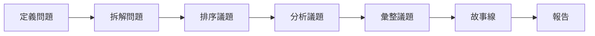

1. 定義問題 (Clarify and define the problem) → SMART Problem Statements
2. 拆解問題 (Structure the problem) → Issue Tree
3. 排序議題 (Prioritize) → 2x2 Matrix
4. 分析議題 (Issue Analysis) → Go Analysis!
5. 彙整議題 (Synthesize) → So what?
6. 故事線 (Storytelling) → SCQA(SCR) + Pyramid Principle
7. 報告 (Presentation) → 1 page 1 statement

---

## 定義問題

首先，在定義問題時，可以先運用 SMART 原則寫出 Problem Statement，==確保問題明確 (Specific)、可被測量 （Mseaurable)、導向行動 (Action-Oriented) 、務實可行 (Realistic) 以及有明確的時間限制 (Time-bound)==。Joelle 舉例，針對「美國市場還有部分尚未抓住的機會」這個模糊問題，可以用 SMART 原則寫出更明確的問題陳述：「透過深度市場解析、成功案例分享、新產品應用搭配，我們團隊有哪些客戶可以優先 pitch，讓我們在 2024 年底前美國市場部分的營收可以提高 15%？」

### 場景一：人力資源（員工留任）

- **模糊問題（Fuzzy）：** 「最近離職率好像有點高，大家好像都不太開心。」
- **SMART 拆解：**
    - **Specific (明確)：** 針對「資深軟體工程師」的「自願離職率」。
    - **Measurable (可測量)：** 從目前的 25% 降低到 15%。
    - **Action-Oriented (導向行動)：** 透過實施競爭力薪資調整、遠端工作選項及導師制度。
    - **Realistic (務實)：** 考慮到市場競爭，降至 15% 是具挑戰性但可行的。
    - **Time-bound (時間限制)：** 在 2024 年底前達成。
- **💡 最終 SMART 問題陳述：**

> 「我們如何透過優化薪資結構與彈性工時制度，在 2024 年底前將亞太區資深軟體工程師的年度自願離職率從 25% 降至 15%？」

---

### 場景二：產品研發（用戶體驗優化）

- **模糊問題（Fuzzy）：** 「APP 太難用了，用戶下載後很快就刪掉。」
- **SMART 拆解：**
    - **Specific (明確)：** 針對「註冊流程」的「次日留存率」。
    - **Measurable (可測量)：** 次日留存率提高 10 個百分點。
    - **Action-Oriented (導向行動)：** 透過簡化註冊表單、導入第三方一鍵登入功能。
    - **Realistic (務實)：** 根據競品研究，流程簡化通常能帶來顯著留存提升。
    - **Time-bound (時間限制)：** 在下一個版本（V2.1）上線後的 3 個月內。
- **💡 最終 SMART 問題陳述：**

> 「在 V2.1 版本上線後的 90 天內，我們應如何透過簡化註冊流程（減少 3 個必填欄位並導入 Google 登入），讓新用戶的次日留存率從 30% 提升至 40%？」

---

### 場景三：營運管理（減少生產浪費）

- **模糊問題（Fuzzy）：** 「工廠原材料浪費很嚴重，成本太高了。」
- **SMART 拆解：**
    - **Specific (明確)：** 針對「A 產品線」的「鋁材耗損率」。
    - **Measurable (可測量)：** 耗損率從 8% 降至 5%。
    - **Action-Oriented (導向行動)：** 透過導入 AI 精準切割設備及進行員工操作再培訓。
    - **Realistic (務實)：** 根據設備商數據，5% 是該設備的標準運作範圍。
    - **Time-bound (時間限制)：** 在未來兩個季度內。
- **💡 最終 SMART 問題陳述：**

> 「我們如何透過導入 AI 自動化切割技術與優化操作手冊，在未來 6 個月內將 A 產品線的鋁材浪費率從 8% 降低至 5%，以達成年度成本控管目標？」

---

### 場景四：客戶服務（提升反應速度）

- **模糊問題（Fuzzy）：** 「客戶抱怨客服回太慢，大家都快氣瘋了。」
- **SMART 拆解：**
    - **Specific (明確)：** 針對「高優先級技術支援工單」的「首回覆時間 (FRT)」。
    - **Measurable (可測量)：** 平均回覆時間從 4 小時縮短至 30 分鐘內。
    - **Action-Oriented (導向行動)：** 建立自動化分類系統並增加晚班支援人力。
    - **Realistic (務實)：** 雖具挑戰，但在導入新工具後人力分配可更精準。
    - **Time-bound (時間限制)：** 於下個月底前達成。
- **💡 最終 SMART 問題陳述：**

> 「為了提升客戶滿意度，我們應如何透過自動化工單分派系統與調整人力排班，在下個月底前將技術支援工單的首回覆時間從平均 4 小時壓縮至 30 分鐘內？」

---

### 場景五：行銷推廣（電子報參與度）

- **模糊問題（Fuzzy）：** 「我們發的電子報都沒人在看，效率很差。」
- **SMART 拆解：**
    - **Specific (明確)：** 針對「B2B 技術電子報」的「開信率」。
    - **Measurable (可測量)：** 開信率從 18% 提升至 25%。
    - **Action-Oriented (導向行動)：** 透過 A/B 測試主旨線、根據用戶興趣進行名單細分。
    - **Realistic (務實)：** 目前平均值低於行業水平，25% 屬於合理改善範圍。
    - **Time-bound (時間限制)：** 於 8 月底前達成。
- **💡 最終 SMART 問題陳述：**

> 「我們應採取哪些標題優化策略與受眾細分方案，在 8 月底前將每週電子報的開信率從目前的 18% 穩定提升至 25% 以上？」

---

## 拆解問題

定義完問題後，第二步需要拆解問題，此時可以透過議題樹 (issue tree) 有架構地分解問題、列出解方。

![[拆解問題常見有五種拆解法]]

如果對問題有一定的理解，也可以改用假設樹 (hypothesis tree) 快速列出可測試的假設。

除了用於拆解問題外，如果要快速理解一個完全不懂的領域，議題樹也可以用來建構對產業理解的核心大綱。從公司年報、財報與官網上瞭解該產業的營收項、成本項和利潤結構，觀察公司處於價值鏈上中下游的哪個位置，接著後設 5 次 Why，一直往下問，問到根源的產業問題。

舉例而言，針對「為何公開職缺越來越少」這個問題，可以一層一層往下深挖：「只有特定產業這樣嗎？」→ 科技業似乎特別嚴重 → 「科技業為何特別嚴重？」→ 因為要降本增效 → 「減少職缺能幫公司省多少錢」→ 帳面上能省 XXX 元 → 「除了財務面，減少職缺還有哪些面向的影響？」「減少職缺對於產業鏈造成何種效應？」如此一層一層往下拆解，就對問題有更清楚、全面的了解。

### 一、 議題樹 (Issue Tree) 案例重構

議題樹的核心在於將「如何做到某件事」或「為什麼發生某事」進行全方位的邏輯拆解。

#### 案例 1：【營收增長】如何將電商平台月營收提升 20%？

此圖採用「數學結構法」，確保所有影響營收的因子都被列出。

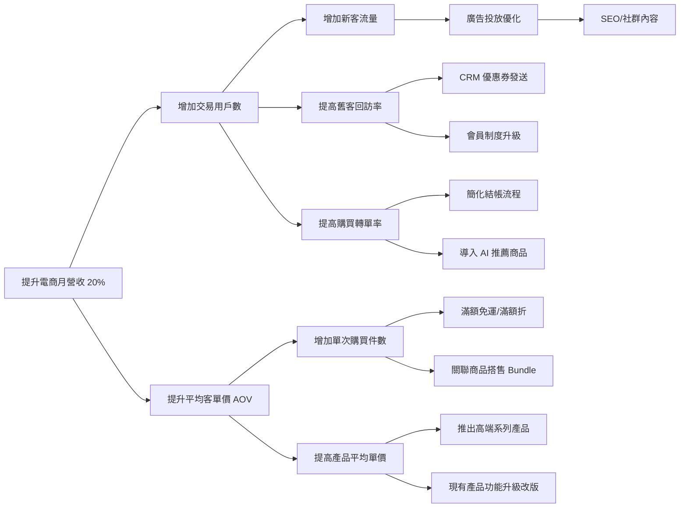

#### 案例 2：【市場進入】我們是否該進軍日本市場？

此圖採用「決策因子法」，將判斷標準 MECE 化。

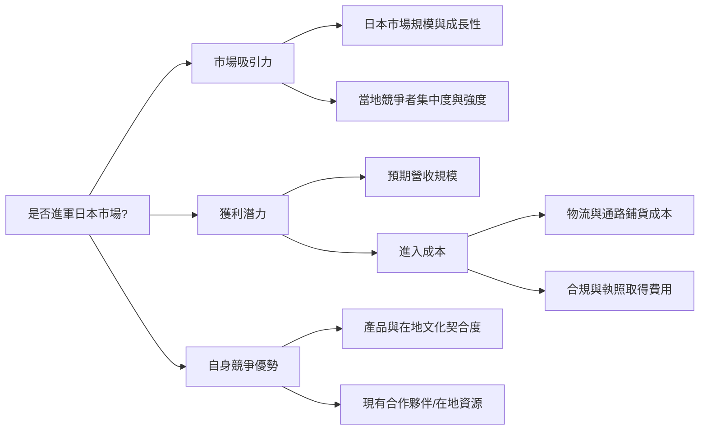

#### 案例 3：【公共議題】如何減少城市尖峰時段交通擁塞？

此圖採用「供需拆解法」。

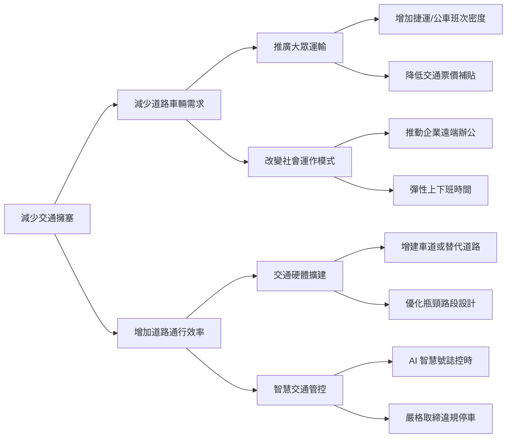

#### 案例 4：【人才招募】如何提升從「投遞履歷」到「報到」的轉換率？

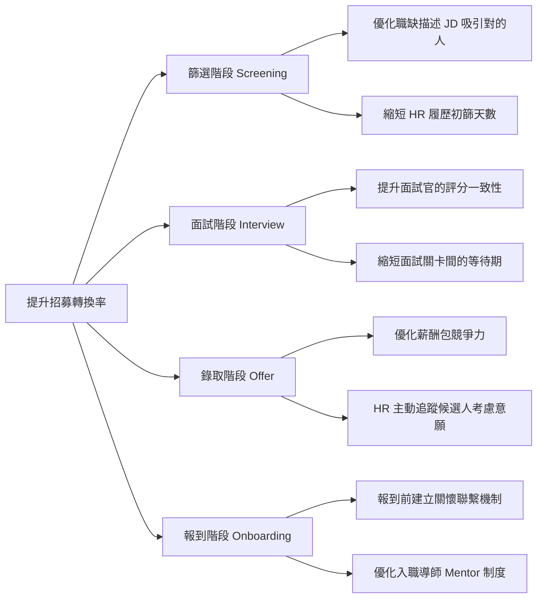

#### 案例 5：【電商留存】為何 App 的月活躍用戶 (MAU) 在下滑？

依據用戶的「生命週期」或「行為特徵」進行細分（Segmentation）。

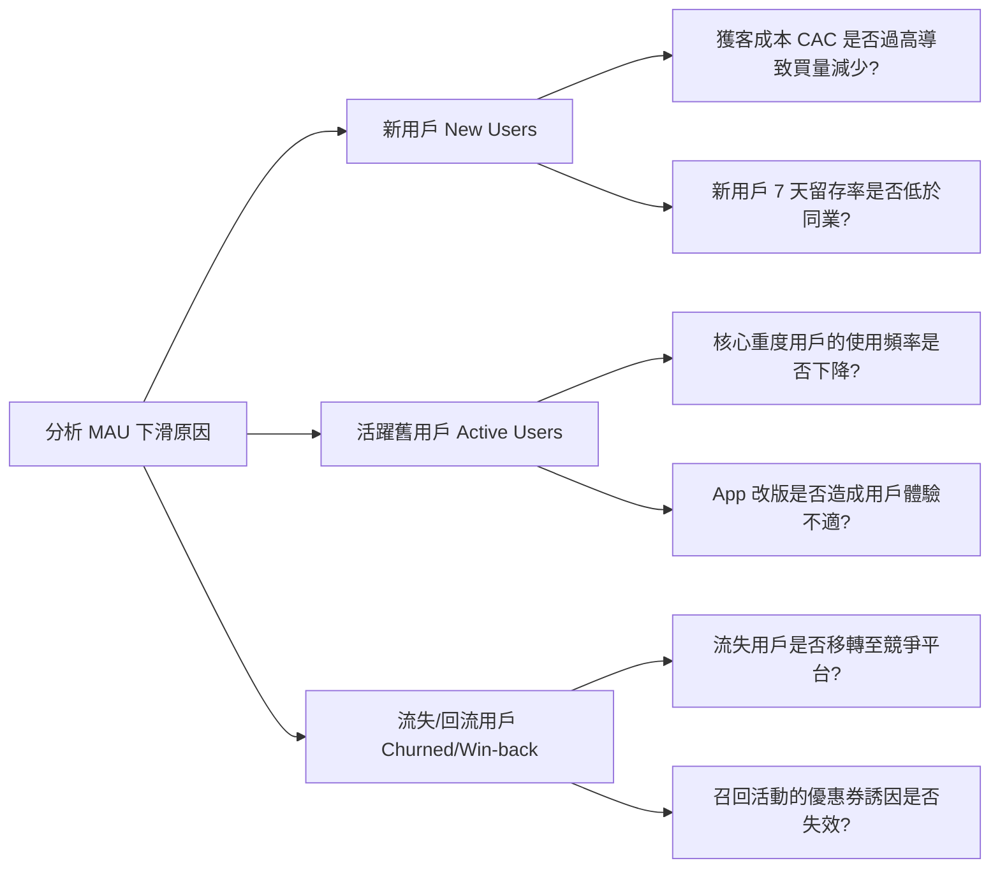

---

### 二、 假設樹 (Hypothesis Tree) 案例重構

假設樹是以「結論」為導向，列出支持該假設成立的所有子條件。

#### 案例 1：【人才流失】假設：薪資不具競爭力是離職主因

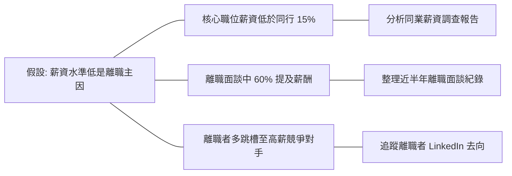

#### 案例 2：【產品開發】假設：用戶不使用新功能是因為「找不到位置」

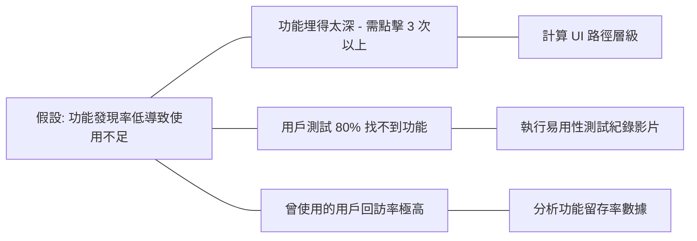

#### 案例 3：【成本管控】假設：物流成本高是因為「倉庫揀貨效率低」

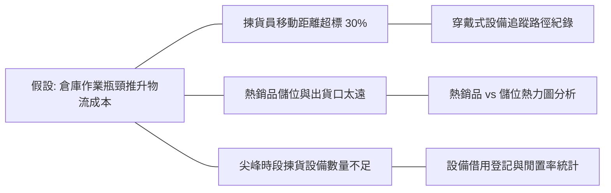

---

## 排序議題

再藉由==以影響力、可行性為兩個主要維度的優先順序分類矩陣 (2x2 Prioritization Matrix)== ，決定哪個解方應優先投入，哪些可以被擺在後面或排除。

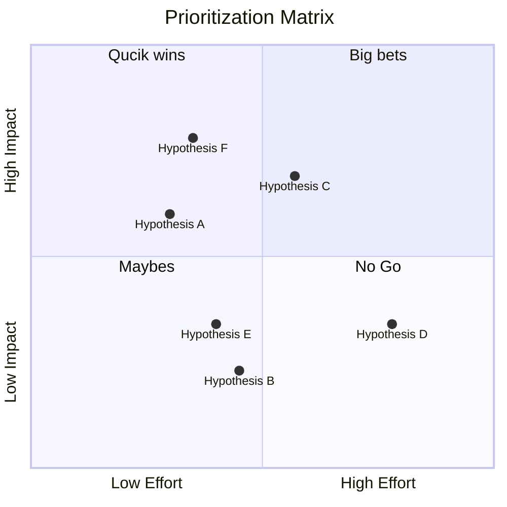

### 案例一：【產品優化】提升電商 APP 用戶轉換率

這個案例專注於透過產品端的改動來優化業績。

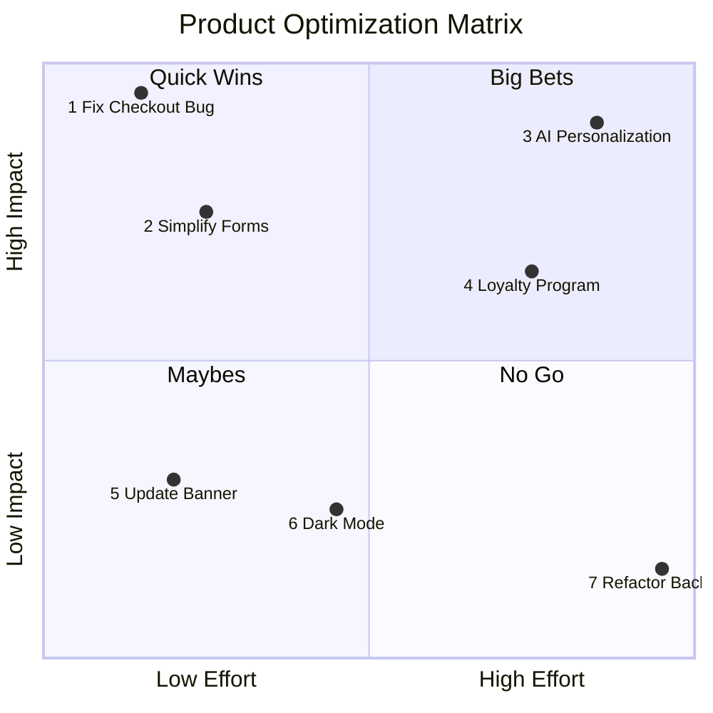

#### **項目說明與定位分析：**

- **(1) Fix Checkout Bug (修復結帳錯誤)**：**Quick Win**。這屬於功能故障，修復難度明確但對防止訂單流失有決定性影響。
- **(2) Simplify Forms (簡化結帳表單)**：**Quick Win**。減少填寫欄位可顯著提升轉換率，且前端調整成本相對較低。
- **(3) AI Personalization (導入 AI 個性化推薦)**：**Big Bet**。雖然能大幅提升客單價，但需要大量數據清洗與演算法開發，投入極高。
- **(4) Loyalty Program (會員點數制度)**：**Big Bet**。有助於長期留存，但涉及財務會計邏輯與複雜的紅利規則設計。
- **(5) Update Banner (更新首頁橫幅)**：**Maybe**。操作簡單，但對核心轉換指標的影響通常很微弱且短暫。
- **(6) Dark Mode (深色模式)**：**Maybe**。雖然用戶喜歡，但開發工作量不小，且對「買單」行為沒有直接貢獻。
- **(7) Refactor Backend (重構後端架構)**：**No Go**。除非現有系統即將崩潰，否則在優化轉換率的脈絡下，這屬於高投入但用戶無感的工程。

---

### 案例二：【行銷策略】B2B 公司增加獲客潛在名單 (Leads)

行銷資源有限，必須決定哪些渠道能帶來最有質量的客戶。

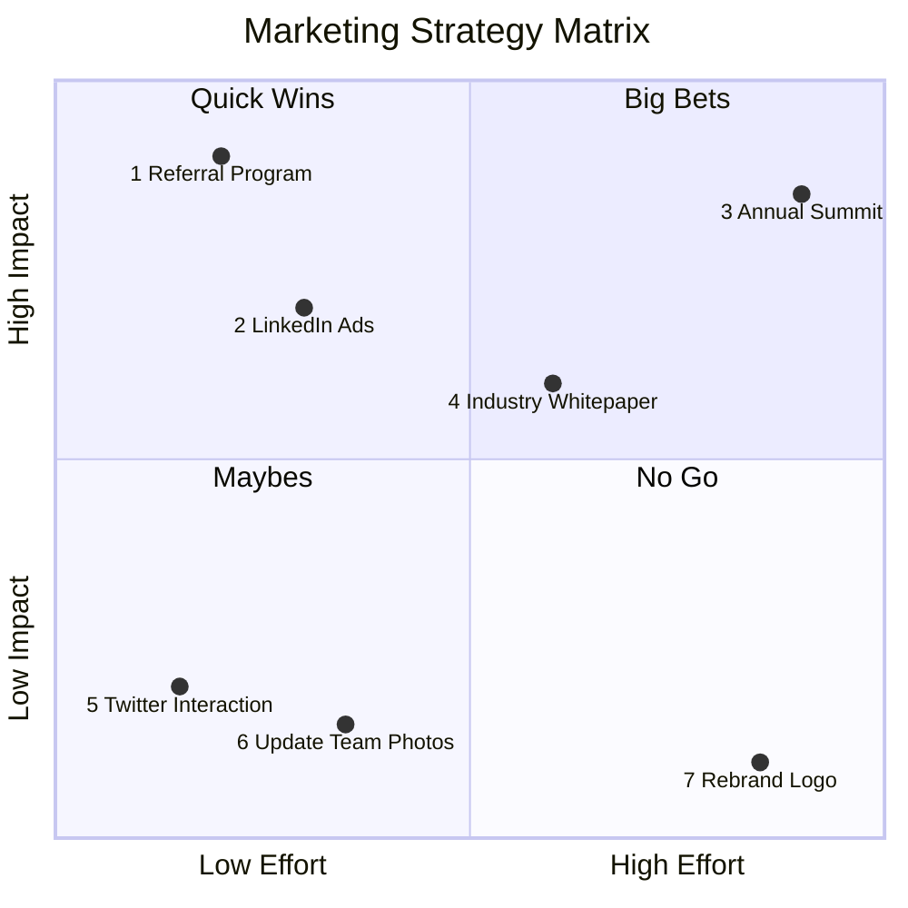

#### **項目說明與定位分析：**

- **(1) Referral Program (現有客戶推薦計畫)**：**Quick Win**。口碑行銷的轉換率最高，且獎勵機制的開發成本相對低。
- **(2) LinkedIn Ads (投放 LinkedIn 廣告)**：**Quick Win**。針對 B2B 精準受眾投放，見效快且設定難度中等。
- **(3) Annual Summit (舉辦年度產業高峰會)**：**Big Bet**。能建立強大品牌權威，但籌備時間長、資源消耗極大。
- **(4) Industry Whitepaper (撰寫產業白皮書)**：**Big Bet**。需要資深專家投入數週時間研究，但能吸引高質量的潛在客戶。
- **(5) Twitter Interaction (社群隨機互動)**：**Maybe**。雖然不花錢，但在 B2B 領域中，這類泛流量很難轉化為實際業績。
- **(6) Update Team Photos (更新官網團隊照片)**：**Maybe**。對建立信任感略有幫助，但無法直接帶來名單增長。
- **(7) Rebrand Logo (更換公司識別系統)**：**No Go**。涉及全公司文宣更換，耗資巨大，且對短期獲客幾乎沒有幫助。

---

### 案例三：【營運管理】提升團隊內部工作效率

管理者的目標是消除瑣事，讓團隊更專注於高價值產出。

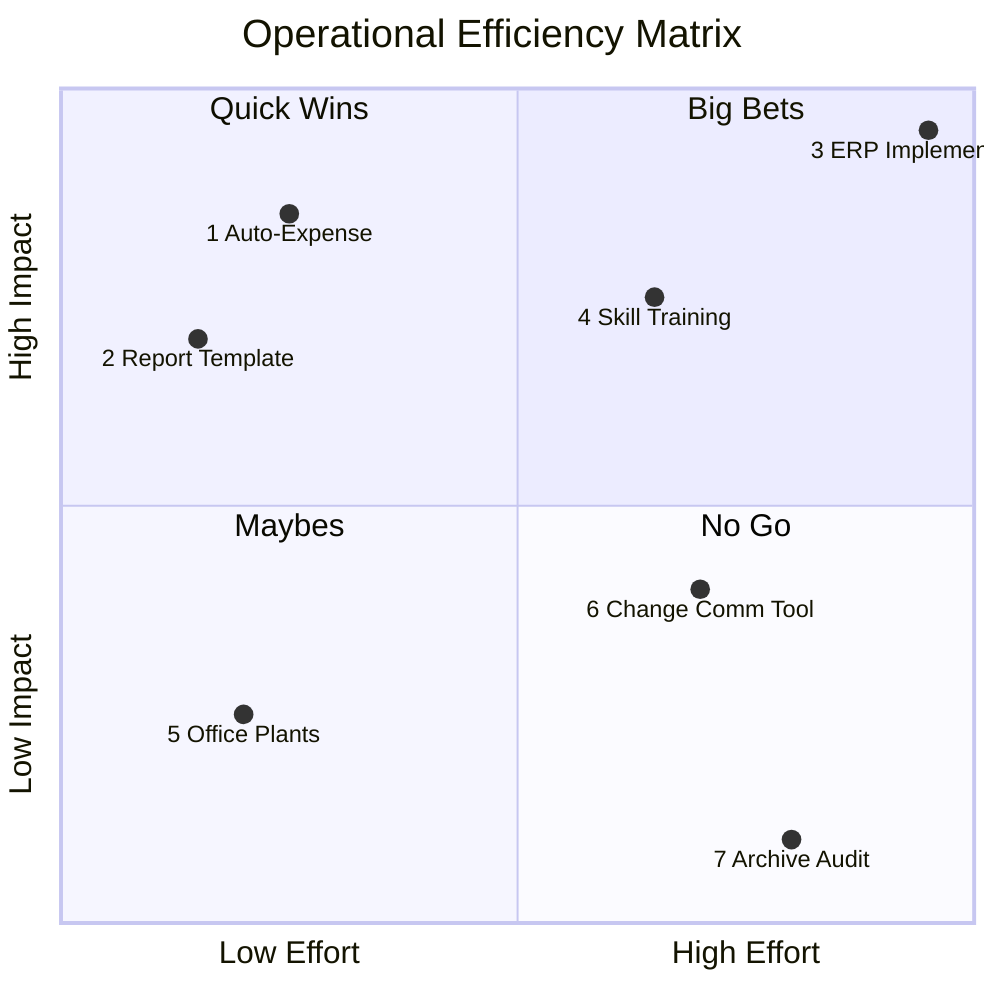

#### **項目說明與定位分析：**

- **(1) Auto-Expense (報銷流程自動化)**：**Quick Win**。利用現成軟體取代手動填表，能立刻釋放全體員工的行政負擔。
- **(2) Report Template (標準化週報範本)**：**Quick Win**。僅需設計一套邏輯，即可減少無效溝通與整理時間。
- **(3) ERP Implementation (導入全公司 ERP 系統)**：**Big Bet**。對效率提升極大，但系統整合是「魔鬼級」難度，容易產生抗拒。
- **(4) Skill Training (全體員工技能培訓)**：**Big Bet**。長期回報高，但短期會占用工作時間且培訓成本不菲。
- **(5) Office Plants (辦公室綠化)**：**Maybe**。改善工作環境心情，但對產出速度的實際影響非常間接。
- **(6) Change Comm Tool (更換內部溝通工具)**：**Maybe**。搬遷成本（歷史紀錄、使用習慣）極高，除非原工具極難用，否則不具優先性。
- **(7) Archive Audit (手動審核舊檔案庫)**：**No Go**。投入大量人工去清理多年前的低頻率使用檔案，極其浪費資源。

---

> [!TIP]
>
> 排序議題的關鍵： > 當你列出這張圖後，應優先啟動 Quick Wins (象限 2) 項目來獲得早期成功（Quick Wins），並為 Big Bets (象限 1) 項目爭取預算與長期資源。

---

## 分析議題

找出每一個要分析假設所需的資料，並實際開始分析。

1. 要分析的假設
2. 可使用的分析方法
3. 資料來源
4. 預期分析結果 e.g. 線圖
5. 分工與期限

### 案例一：【人才留任】資深工程師離職率過高

**假設：** 公司目前的薪資福利在市場上不具競爭力，導致優秀人才被挖角。

|**1. 要分析的假設 (Hypothesis)**|**2. 分析方法 (Method)**|**3. 資料來源 (Source)**|**4. 預期分析結果 (Expected Result)**|
|---|---|---|---|
|核心職位的平均月薪低於市場第 $75$ 百分位數超過 $15\%$。|市場基準對照 (Market Benchmarking)。|外部薪資調查報告（如 Hays、Mercer）、LinkedIn 薪資數據。|**長條圖：** 公司內部薪資級距與同業競爭對手（A、B、C 公司）的對照。|
|離職原因與薪資高度相關。|離職面談質性分析與量化統計。|過去 12 個月 HR 離職面談紀錄。|**圓餅圖：** 離職原因分類比例（如：薪資、管理、職涯發展）。|
|離職者多數流向薪資更高的競爭對手。|競爭對手追蹤分析。|LinkedIn 離職者動態、社群媒體追蹤。|**表格：** 離職人員流向公司清單及其平均薪資水平。|

---

### 案例二：【電商轉化】結帳流程流失率過高

**假設：** 目前的結帳表單欄位過多，導致用戶在最後一步放棄購買。

|**1. 要分析的假設 (Hypothesis)**|**2. 分析方法 (Method)**|**3. 資料來源 (Source)**|**4. 預期分析結果 (Expected Result)**|
|---|---|---|---|
|用戶在「填寫地址」欄位的流失率顯著高於其他步驟。|漏斗分析 (Funnel Analysis) 與欄位流失率分析。|Google Analytics (GA4) 轉換追蹤、Mixpanel 事件紀錄。|**漏斗圖：** 顯示每一項表單欄位（姓名、電話、地址）的流失百分比。|
|用戶對「非必要欄位」有明顯的抗拒。|使用者熱點圖與錄影分析 (Heatmap & Recording)。|Hotjar 或 Microsoft Clarity 的用戶行為錄影。|**熱力圖：** 顯示用戶在哪些欄位停留過久或反覆修改。|
|導入「一鍵結帳」能有效降低流失率。|A/B 測試 (A/B Testing)。|實驗組與對照組的隨機測試數據。|**數據對比：** 現有流程與簡化流程的轉換率差異（顯著性測試）。|

---

### 案例三：【營運效率】行政報銷流程耗時過長

**假設：** 人工審核與手動填表導致全公司每月浪費大量高薪人力在低價值行政作業。

| **1. 要分析的假設 (Hypothesis)** | **2. 分析方法 (Method)**             | **3. 資料來源 (Source)**  | **4. 預期分析結果 (Expected Result)**                    |
| -------------------------- | -------------------------------- | --------------------- | -------------------------------------------------- |
| 每位員工平均每月花費 $4$ 小時處理報銷單據。   | 員工時間抽樣調查與測量 (Time-Motion Study)。 | 員工問卷調查、行政系統報銷申請時間戳記。  | **堆疊長條圖：** 顯示不同職級員工花費在「核心業務」與「報銷行政」的時間比例。          |
| 報銷單退件重填的主要原因在於「規則過於複雜」。    | 錯誤類型根因分析 (Root Cause Analysis)。  | 財務部退件紀錄、報銷系統錯誤提示 Log。 | **柏拉圖 (Pareto Chart)：** 找出導致 $80\%$ 退件率的前三大主要錯誤原因。 |
| 導入自動化報銷系統的 ROI 能在 6 個月內回收。 | 成本效益分析 (Cost-Benefit Analysis)。  | 軟體訂閱報價單、節省的人工工時折算成本。  | **ROI 計算表：** 呈現軟體投入成本 vs. 減少工時後的財務節省空間。            |

---

## 彙整議題

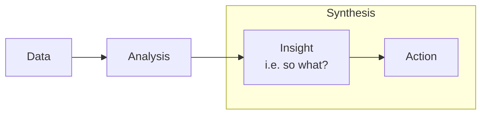

> If we wanted to be a trusted, insightful advisor to CEOs and senior executives, we needed to synthesize, not summarize. Anyone can summarize — synthesis is much more valuable. Synthesis = summary + insight.

彙整議題就是把前面分析的結果總結後加上自己的 insight。

> In practice, this core principle – synthesize, don’t summarize – led to a frequently used maxim at McKinsey: “Where’s the ‘So What?’”

白話來說，就是對於所有分析結果，問 so what?

獲得 so what 方法

1. key takeaways in summary: 必須先確認總結到底總結了什麼，是好還壞？是符合預期還是不符合預期？跟過去標竿比有什麼差別？
2. root causes: 了解 takeaways 的下一步一定自然會問 why these takeaways happened? 此處如果沒有更多數據，就必須提出我們的看法（也就是假設）
3. implications: ==了解 takeaways + root causes 後，就能回答這到底會對我們、客戶造成什麼具體的影響，這就是 implications 也就是 so what 的結果==

E.g.

1. summary: “50% of deals that reached the contract stage typically closed.”
2. synthesis: “50% of deals that reach the contract stage typically closed. This is pretty concerning, because it’s down from our historical average of 60% close rate. We think there may be two reasons for the decrease: (1) lower sales team productivity, and (2) higher loss rates to our competitor. We need to address this problem quickly, because if we don’t, we’re going to lose market share quickly.”

### 案例一：【業績分析】電商平台轉換率下降

- **Key Takeaway (Summary):** 本季結帳轉換率由 $3\%$ 下降至 $2\%$，低於去年同期標竿且未達目標。
- **Root Causes (Why):** 初步數據顯示流失主要發生在行動端，懷疑是上週版本更新後，行動版結帳頁面載入速度變慢（超過 5 秒）。
- **Implications (So What):** 如果轉換率維持在 $2\%$，我們將在下半年損失約 $1,000$ 萬元的潛在營收，並導致獲客成本 (CAC) 飆升，使得廣告投放失去邊際效益。
- **Action:** 立即回滾 (Rollback) 結帳模組版本，並優化圖片壓縮與腳本載入順序。

---

### 案例二：【人才留任】資深工程師集體離職

- **Key Takeaway (Summary):** 過去三個月資深工程師自願離職率達 $15\%$，是公司歷史平均值（$5\%$）的三倍。
- **Root Causes (Why):** 離職面談顯示競爭對手以「全遠端辦公」與「高出 $20\%$ 的薪資」大規模挖角，而我們目前仍維持強制回辦公室政策。
- **Implications (So What):** 核心人才流失將導致重點專案 A 延遲半年上線，直接影響明年第一季的市場份額，且招募新人的成本（獵才費 + 培訓期）將高於現有人員加薪總額。
- **Action:** 啟動「彈性辦公 (Hybrid Model)」試辦計畫，並針對核心關鍵人才進行調薪。

---

### 案例三：【營運成本】工廠原材料浪費過高

- **Key Takeaway (Summary):** 鋁材耗損率連續兩季維持在 $8\%$，高於產業標準的 $5\%$。
- **Root Causes (Why):** 經現場觀察，主要原因在於切割機台老化導致精度下降，以及夜班員工操作流程與 SOP 不一致。
- **Implications (So What):** 這 $3\%$ 的額外耗損每年吃掉公司 $500$ 萬元的淨利，使我們在低價市場失去價格競爭力。
- **Action:** 編列預算更新切割模組，並於下週啟動員工操作再教育訓練。

---

### 案例四：【行銷效果】電子報點擊率低迷

- **Key Takeaway (Summary):** 每週技術電子報的點擊率僅為 $1.5\%$，遠低於行業平均的 $3\%$。
- **Root Causes (Why):** 假設原因有二：(1) 主旨不夠吸引人，(2) 內容過於生硬，未針對不同興趣的用戶進行分群投遞。
- **Implications (So What):** 持續低點擊率將導致信箱供應商將我們的網域標記為垃圾郵件，這會毀掉我們最重要的低成本引流管道，讓未來的產品發布無法接觸到現有客戶。
- **Action:** 導入內容細分 (Segmentation) 機制，並針對下一封電子報的主旨進行 A/B 測試。

---

### 案例五：【客戶服務】技術支援回覆太慢

- **Key Takeaway (Summary):** 高優先級工單的首回覆時間平均為 $4$ 小時，與設定的 $30$ 分鐘目標有極大差距。
- **Root Causes (Why):** 人工手動分類工單導致在尖峰時段產生瓶頸，且資深客服人員忙於撰寫重複性報告而非處理問題。
- **Implications (So What):** 長時間的等待正導致大客戶續約意願下降，若不改善，明年我們可能面臨超過 $20\%$ 的客戶流失率 (Churn Rate)。
- **Action:** 導入自動化工單分類系統，並將常見問題 (FAQ) 自動化推送給第一線人員以節省查閱時間。
---

## 故事線

先用一句話總結想傳達的內容。如果發現寫不出來，就需要回去思考前面這些問題。

好的故事線則包含以下條件：

- 目標明確：能清楚用一句話總結，快速切入重點
- Impact 清楚：內容對聽眾的影響明確，且確實有痛處
- 內容簡潔：清晰易懂、切合重點，不會資訊量太大
- 奠基於事實且邏輯清晰：能以數據化呈現的部分，就用數據支持
- 行動導向：清楚指出聽眾的下一步，產生行動衝動

如果要做到以上條件，在架構故事線前需要回答以下四個問題：

1. Who：觀眾是誰？數量多少？對這個主題的知識水平到哪裡？
2. What：要達到的目標？要聽眾做的事？
3. Where：活動是以線上還是線下為主？形式為正式還是非正式？
4. Why：要如何可以達到目標？觀眾為什麼要聽？

架構故事線的方法: SCQA(SCR) + 金字塔

1. 前情提要必須有切身之痛才能引起效用
    
    - 情境（Situation）：情境要夠痛，能夠引發聽眾共鳴。例如：Pipeline visibility 是協助 Sales 有效完成工作的重要功能。
    - 複雜性（Complication）：痛點的複雜性在哪？例如：現在 Sales 要使用 3 個 Dashboards 才能查看完整的 Pipeline 資訊，大大降低 Dashboards 的使用率，也浪費了 Sales 的時間。
    - 解決方案 (Resolution)：解決方案能如何解決問題？解決到什麼程度？例如：新工具將所有 Dashboards 整合到同一個平台中，可以直接一站式管理和查詢。
        
2. [[金字塔原理]]

> **💡 擴充範例與實戰練習：SCQA 腳本設計**
>
> **情境：** 向總經理提案「導入遠端工作制度」。
>
> - Situation (情境 - 大家都同意的事實):
> 
> 「過去三年疫情期間，公司被迫採用遠端工作，這期間我們的專案準時交付率維持在 95% 以上，顯示員工在遠端環境下仍能維持高產出。」
>
> - Complication (衝突 - 遇到的新問題/痛點):
> 
> 「然而，隨著強制回辦公室政策實施後，我們發現員工滿意度下降了 15%，且近兩個月有 3 位資深工程師離職，理由皆是『缺乏工作彈性』。同時，競爭對手 X 公司已全面開放遠端，正在積極挖角我們的人才。」
>
> - Question (問題 - 隱含的疑問):
> 
> 「（因此，我們面臨的問題是）如何在維持團隊協作效率的同時，又能留住人才並提升滿意度？」
>
> - Answer/Resolution (答案 - 你的核心建議):
> 
> 「我們建議實施『3+2 混合辦公制』（3 天進公司、2 天自由選擇），這預計能將離職率降低至 5% 以下，且無需增加額外薪資成本。」

---

## 報告

![[BCG問題解決力#^e65749]]

### 簡報呈現 tips

- 數字、英文字與中文字要有一個空格做為間隔
- 圖表注意重點：
    - 雜訊排除（如：背景底線、highlight 想要突出的重點）
    - 圖表提供標題

### 簡報中心思想

- **釐清目的**：每頁只傳達 **一個重點**
- **聚焦訊息**：保留聽眾需要記住的關鍵，不要塞滿文字
- **強調重點**：用 **粗體**、顏色（不超過 2 種）標出關鍵字
- **行動導向**：每頁需有 **小結**，可連結到行動或決策
- **刪除干擾**：圖表不放無關或裝飾性元素

### 常用簡報架構

以下為常用的簡報框架，凡事總有例外，不過通常就會被問到這些。

- **分析任務型：**1. 分析目的/背景說明 → 2. 分析方法/圖表說明 → 3. 分析結果 → 4. 行動方案
- **問題解決型：**1. 現況說明 → 2. 原因分析 → 3. 解決方案 → 4. 預期成效
- **決策支援型：**1. 核心結論 → 2. 關鍵依據 → 3. 可行選項 → 4. 建議行動
- **Timeline 型：**1. 近況說明 → 2. 後續進度 + Timeline 表
