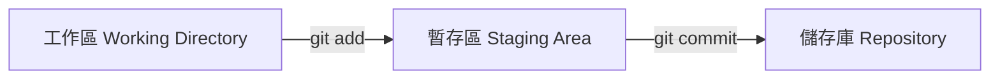
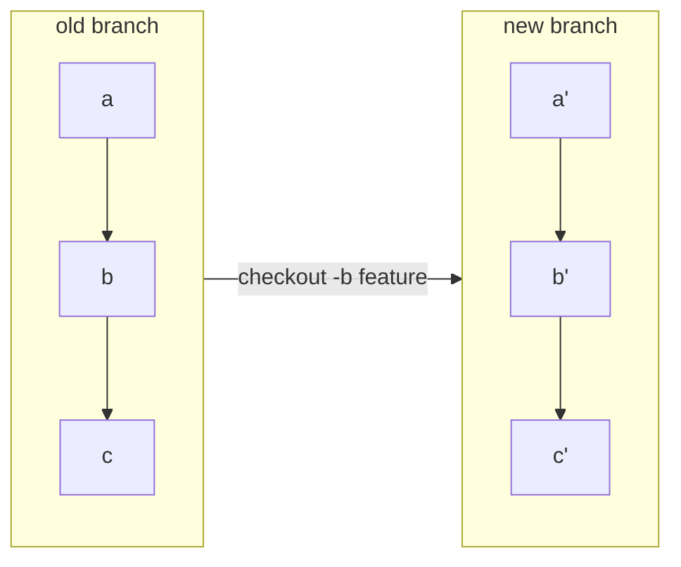
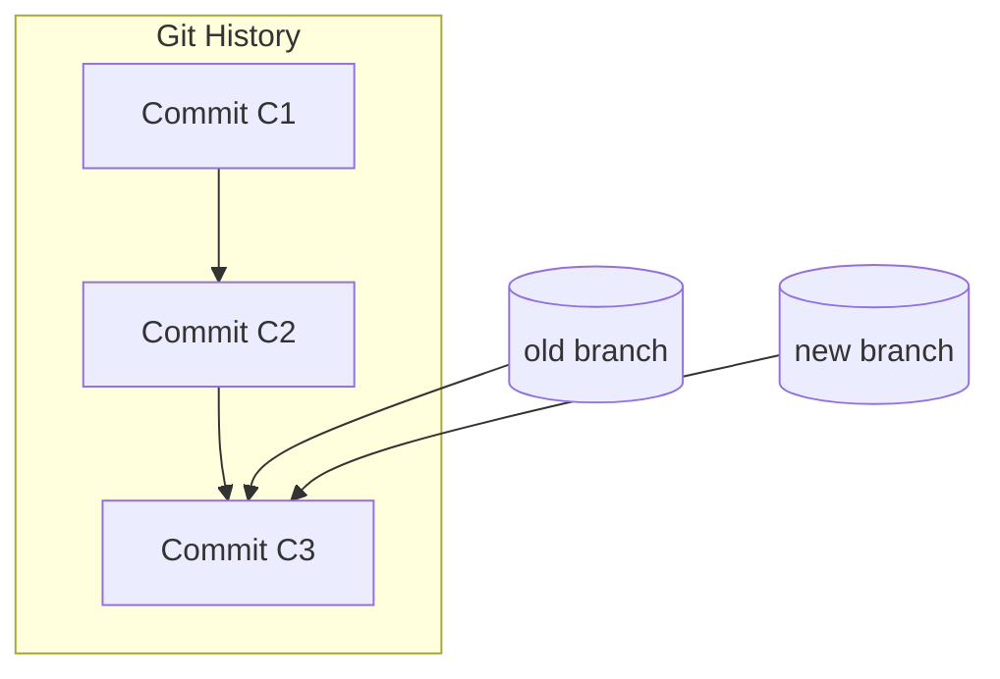
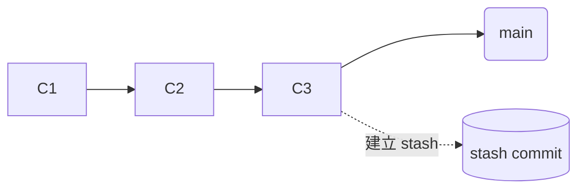
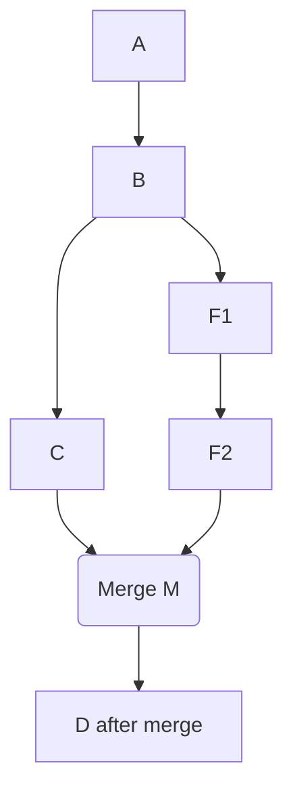
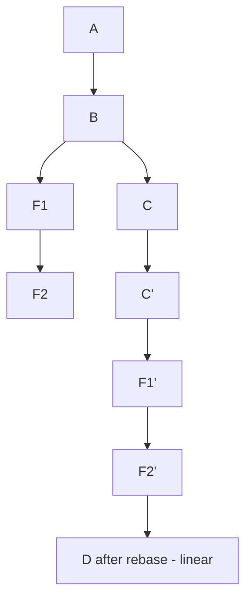

## 第一部分：基礎複習 — 工作區、暫存區、儲存庫



- **工作區**：實際檔案
    
- **暫存區**：你這次 commit 想包含哪些修改
    
- **儲存庫**：存放 commit DAG（真正的版本歷史）

---

## 第二部分：心智模型

### 2.1 初學者錯誤理解

多數人以為：

- 每個 commit = 整份專案完整複製
    
- branch = 複製全部 commit
    
- merge = 比對每個 commit 的差異

錯誤想法示意：



---

### 2.2 正確心智模型：Commit 不是複製，是「指向父節點 + 差異」



每個 commit **僅記錄**：

1. 父 commit 是誰（parent）
    
2. 這次修改的差異（blob / tree）

Branch 本質上只是指標:

- branch 是一個「名字」指向某個 commit
    
- 建立 branch 完全不複製 commit

---

## 第三部分：理解更多 Git 概念

### 3.1 HEAD 是什麼？

HEAD = **你目前所在的位置**。

通常：

```python
HEAD → branch → commit
```

但若 checkout 某 commit，則：

```python
HEAD → commit（branch 不動）
```

= detached HEAD

---

### 3.2 remote add 背後只是「多一個指標名稱」

遠端只是另一組 refs：

```python
origin/main → 某 commit
origin/dev → 某 commit
```

你可以有多個遠端：origin, upstream, company 等等。

---

### 3.3 checkout：branch / commit / 單檔

#### 切換 branch

```python
git checkout feature
```

#### 切換到某 commit（進入 detached HEAD）

```python
git checkout abc123
```

#### 單檔切換到過去版本

```python
git checkout abc123 -- app.py
```

此操作不會切換 HEAD，不會變 detached HEAD。

---

### 3.4 Tag vs Branch（強化版）

|項目|Branch|Tag|
|---|---|---|
|是否會移動|✔|✘ 永遠指向固定 commit|
|是否用於開發|✔|✘|
|是否標示版本|✘|✔ release 用|

#### branch 常用語法

```python
git branch -a   # 列出所有本地 + 遠端追蹤分支

git branch -r   # 只看遠端追蹤分支
```

#### Tag 常用語法

建立 lightweight tag：

```python
git tag v1.0
```

建立 annotated tag（推薦）：

```python
git tag -a v1.0 -m "Release 1.0"
```

推到遠端：

```python
git push origin v1.0
```

刪除本地：

```python
git tag -d v1.0
```

刪除遠端：

```python
git push origin :refs/tags/v1.0
```

#### 何時使用 tag？

- 部署版本
    
- release notes
    
- CI/CD pipeline 的觸發點

---

### 3.5 git log vs git reflog

#### git log：版本歷史（真正 committed）

```python
只顯示 commit DAG
```

#### git reflog：HEAD 移動紀錄（本地私有）

```python
包含你 checkout、reset、rebase、amend 造成的 HEAD 變化
```

reflog 才能救檔案。

### 3.6 Stash 是什麼？

Stash = 建立一個沒有 branch 指向的 commit（暫存變更）。



stash 實際上是：

- commit（甚至是兩層 commit：index + working directory）
    
- 沒有被 branch 指到
    
- 被特殊名稱 `refs/stash` 管理

### 3.7 orphan commit 是什麼？

orphan commit（孤兒 commit）的定義：

> **這些 commit 沒有任何 ref（branch、tag、stash、HEAD）指向。**

你在 detached HEAD 模式下 **產生新的 commit**，但
**沒有任何 ref（branch/tag）會自動指向它們**。

例如：

```python
git checkout abc123   # detached
echo "x" >> a.txt
git commit -am "test"  # commit D
```

此時：

```python
HEAD → D
但沒有 branch → D
```

只要你 checkout 其他 branch：

```python
git checkout main
```

D 就變：

```python
沒有人指向 → orphan commit
```

Git 就會在一段時間後把它們 GC（垃圾回收）

## 第四部分：Merge vs Rebase

[【Git教學】分支合併: merge 與 rebase 差異](https://www.maxlist.xyz/2020/05/02/git-merge-rebase/)

### 概覽（一句話）

- **Merge**：把兩條歷史合併，通常保留分叉歷史，可能產生 _merge commit_。
    
- **Rebase**：把一條分支的 commit「重新套用」到另一條分支上，改寫原來的歷史，使歷史看起來線性。

---

### 視覺示意（mermaid flowchart）

#### Merge（有 merge commit，保留分叉）



#### Rebase（把 feature 的 commit 重貼到 main）



（重點：F1/F2 會變成 F1'/F2' — 新的 commit hashes）

---

### 面向比較

#### 1) 歷史形態（可見性）

- **Merge**：保留原始分叉記錄，產生 merge commit → 歷史呈現「分支/合併」的真實軌跡。適合想保留誰在什麼時間合併了什麼的情境。
    
- **Rebase**：把 feature 分支上的每個 commit 逐一套用到目標分支的 tip 上，結果是線性的歷史（好看但改寫了原始 commit hashes）。

#### 2) commit 的 hash / 身份

- **Merge**：原本的 commits 保持不變（hash 不變），另外新增一個 merge commit。
    
- **Rebase**：原本的 commits 被重新建立（新的 commit hash），因為 parent 改了 → **等於改寫歷史**。

#### 3) 衝突 (conflict) 處理差異

- **Merge**：如果發生衝突，衝突會在 merge 的那一步發生 — 你解決衝突後做一個 merge commit。
    優點：一次性解決整體差異，合併點後保有「誰解了衝突」的記錄（merge commit）。
    
- **Rebase**：衝突可能在「每一個要重放的 commit」上發生（如果每個 commit 都改到了相同區域），你要針對每個衝突的 commit 解決並 `git rebase --continue`。
    優點：衝突會更早、分散出現，且解決後歷史更乾淨。缺點是重複性的衝突處理（可能重複處理相近衝突）。

#### 4) 共同協作（共享分支）風險

- **Merge**：安全。合併不會改寫既有 commit，適合多人共同使用的主線（main、dev）。
    
- **Rebase**：不應該對已對外共享（pushed & 被他人 checkout）的 commit 做 rebase，因為會改寫歷史，造成其他人本地分支需要強制同步（force push、rebase 他們的工作）→ 會弄壞團隊工作流。

#### 5) 日誌（git log）可讀性

- **Merge**：保留完整事件脈絡（誰何時 merge、哪些 branch 何時合併）。但 log 可能比較「雜」。
    
- **Rebase**：線性歷史，適合希望 `git log --oneline --graph` 很乾淨的專案，容易看懂改動順序。

#### 6) fast-forward 與 --no-ff

- 若 main 沒有進展，merge 可以是 **fast-forward**（直接把 branch 指向最新 commit，沒有 merge commit）。
    
- 用 `--no-ff` 可以強制產生 merge commit（保留合併意圖，即使可 fast-forward）。

---

### 常見實務指令與情境（含範例）

#### A. 使用 Merge（團隊整合）

```python
git checkout main
git fetch origin
git merge --no-ff feature-xyz
git push origin main
```

- `--no-ff`：即便可 fast-forward，也建立一個 merge commit，保留「feature-xyz 被合併」的事件。

##### 何時用：

- 合併大型 feature、release branch、多人開發的分支。
    
- 想保留分叉與合併記錄（審查歷史、追溯責任）。

#### B. 使用 Rebase（保持線性歷史）

把 feature 重貼到 main：

```python
git checkout feature-xyz
git fetch origin
git rebase origin/main
# 解衝突、git rebase --continue
git checkout main
git merge --ff-only feature-xyz
git push origin main
```

- `git merge --ff-only`：確保 merge 只做 fast-forward（不要意外產生 merge commit）。

##### 何時用：

- 個人分支在本地整理 commit（如整理成有意義的小步驟）。
    
- 在 PR 前讓歷史乾淨（但 PR 合併策略要 align 團隊規範）。

#### C. Pull 時要用哪個？

- `git pull` 預設 = `fetch` + `merge`。
    
- 想要線性歷史，可使用 `git pull --rebase`（把本地 commits 重新放到遠端更新之後）：

    ```python
    git pull --rebase origin main
    ```

---

### conflict 處理差異（實務注意）

- **Merge**：一次性衝突解決 → 做 `git add` → `git commit`（merge commit）。容易追蹤到是哪次合併產生衝突。
    
- **Rebase**：可能在每個被重放的 commit 發生衝突 → 解完 `git rebase --continue`。若很多相似衝突，可能要多次重複同樣的修正。
    技巧：在 rebase 前先把 main merge 到 feature（`git merge origin/main`），先在 feature 解一次衝突，再 rebase（雖然做法怪但可減少多次衝突），但要小心改寫歷史。

---

### 變更/回復操作（如何還原失誤）

#### Merge 發生問題：撤銷 merge

- 若尚未 push，最簡單：

    ```python
    git merge --abort
    ```

    或

    ```python
    git reset --hard ORIG_HEAD
    ```

- 若已經 push 且要保留主線穩定：使用 `git revert` 來回滾 merge（不改寫歷史）：

    ```python
    git revert -m 1 <merge-commit-hash>
    ```

    `-m 1` 指定父分支（通常選 main 為父 1）。

#### Rebase 發生問題：停止或還原

- 在 rebase 過程中出現衝突，想放棄：

    ```python
    git rebase --abort
    ```

- 若已完成 rebase 並 push（錯誤地改寫了共享歷史），恢復比較麻煩：使用 `git reflog` 找到原來的 HEAD，然後 `git reset --hard <old-head>`，或讓其他協作者也 reset。一般建議避免這種情況（不要 rebase 已公開的 commit）。

### Squash：interactive rebase 常用範例

把最近 4 個 commit 整理：

```python
git rebase -i HEAD~4
# 編輯 pick/squash/fixup，之後 git rebase --continue
```

- `pick`：保留 commit
    
- `squash`：把該 commit 合併到前一 commit，並讓你編輯 message
    
- `fixup`：合併但捨棄 message

---

### 常見誤解與正確做法（Checklist / 規則化建議）

1. **不要對已經推送並且其他人可能基於它做開發的分支做 rebase。**
    
2. **個人分支（private）在 PR 前可用 rebase 清理 commit；合併到主線時用 merge 或團隊約定的策略。**
    
3. **如果想保留合併意圖但又想線性歷史，可以在合併前用 `rebase -i` 把小 commit 合併（squash）成較少、語意清楚的 commit，再 merge。**
    
4. **若團隊偏好乾淨線性 history，可以採用 `git pull --rebase` + PR merge 設為 fast-forward only；但所有成員需理解 rebase 的限制與回復方式。**
    
5. **CI / Release 流程：對公開 release branch 不要做 rebase；對 tag 也不要改寫。**

---

### 最後：決策樹（何時用哪個？）

- 你在做**個人本地工作**、想要乾淨歷史 → **rebase**（或 interactive rebase）
    
- 你在做**多人協作**、要合併 feature 到 shared main → **merge**（通常保留 merge commit 或依團隊規範）
    
- 你想**保留合併事件**（誰 merge、何時） → **merge --no-ff**
    
- 你不確定、希望安全 → **merge**（較保守）

## 第五部分: Reset vs Restore

### 🔥 先給你一句話版本（最重要的概念）

- **reset 是改 HEAD 的位置（然後視模式決定是否連帶修改 index / working directory）**
    
- **restore 是改 index / working directory 的內容（但不動 HEAD）**

換句話說：

> **reset = 改歷史位置**
> **restore = 改檔案內容**

---

### 第一部分：reset 在做什麼？（核心心智模型）

#### reset 的本質

```python
git reset <target>
```

它做三件可能的事（取決於模式）：

|操作項目|soft|mixed（預設）|hard|
|---|---|---|---|
|移動 HEAD|✔️|✔️|✔️|
|修改 index（暫存區）|❌|✔️|✔️（重設成 target 的 index）|
|修改 working directory|❌|❌|✔️（覆蓋 working files）|

#### 重點：reset 永遠會「改 HEAD」

其他動作（是否更動 index / working dir）取決於你 soft/mixed/hard 用哪一種。

---

### 第二部分：restore 在做什麼？（核心心智模型）

#### restore 只做「檔案恢復」

它讓你把 index 或 working directory 的某些檔案恢復成另一個版本，但 **不會改 HEAD**。

#### 兩種 restore 模式

```python
git restore <file>          # 恢復 working directory
git restore --staged <file> # 恢復 index （取消 git add）
```

#### restore 不會：

- 不會移動 HEAD
    
- 不會改 commit 歷史
    
- 不會刪除 commit

它只是：

> **把某些檔案回復到你指定的版本（HEAD 或某個 commit）**

---

### 第三部分：深入比較 reset & restore 的行為

#### ❗差異 1：reset 會動 HEAD，restore 不會

```python
git reset HEAD~1
```

→ HEAD 從 commit C 指向 C-1

```python
git restore .
```

→ HEAD 完全不動，只動檔案

---

#### ❗差異 2：restore 是安全操作，reset 是破壞性操作

restore 不會改歷史 → 完全安全
reset（尤其 hard）可能會讓 commit 失去指標 → 變成 **orphan commit**（等待 GC）

---

#### ❗差異 3：restore 用來「回復檔案」，reset 用來「回復分支 / 歷史」

情境例：

##### 我要取消 git add

```python
git restore --staged my.py
```

（正確方式）

如果你用 reset 也可以：

```python
git reset HEAD my.py
```

但語意上 restore 比 reset 清楚（Git 官方推薦）。

---

### 第四部分：reset 的三種模式（超清晰解釋）

這裡用你最 care 的方式 → 三層模型：

```python
HEAD → index → working directory
```

---

#### 1. reset --soft

```python
git reset --soft <commit>
```

- 移動 HEAD
    
- index / working dir 不變

##### 心智模型

> **回到舊 commit，但保留變更全部在 staging area（像剛剛 add 過）。**

##### 常用情境

把最後一次 commit 改成更漂亮的 message：

```python
git reset --soft HEAD~1
git commit -m "新的說法"
```

---

#### 2. reset --mixed（預設）

```python
git reset <commit>         # = reset --mixed
```

- 移動 HEAD
    
- 重設 index = 的 index
    
- working directory 不變

##### 心智模型

> **回到舊 commit，保留變更，但變成 unstaged（在 working dir）**

##### 用途

取消 staging + 取消 commit

```python
git reset HEAD~1
```

（修改都還在，等你重新 add）

---

#### 3. reset --hard（最危險）

```python
git reset --hard <commit>
```

- 移動 HEAD
    
- index 重設
    
- working dir 也覆蓋成 target commit

##### 心智模型

> **回到舊 commit，刪掉所有未 commit 的變更。**

##### 風險

Working directory 中未 commit 的改動 → 直接消失
而且被刪掉的 commit 會變成 orphan（如果無任何 ref），等 GC

---

### 第六部分：實務比較（你會最常用到的）

#### reset 使用決策樹

- 想修改 commit message
    → `reset --soft HEAD~1`
    
- 想取消 commit，但保留修改
    → `reset --mixed HEAD~1`
    
- 想全部丟掉
    → `reset --hard HEAD~1`

#### restore 使用決策樹

- 想取消 git add
    → `git restore --staged <file>`
    
- 想讓檔案回到最近 commit
    → `git restore <file>`
    
- 想回到某舊 commit 的檔案版本
    → `git restore --source=<commit> <file>`

---

### 第七部分：哪個危險？怎麼救回？

#### reset（danger）

- 覆蓋 HEAD
    
- 某些 commit 變成孤兒
    
- 有可能 GC 掉

#### restore（safe）

- 不動 commit 歷史
    
- 不會造成任何 commit 消失
    
- 最安全的操作之一

#### 救援方式

- 若 reset 造成 commit 消失：

    ```python
    git reflog
    git reset --hard <old-hash>
    ```

- 若 restore 覆蓋檔案：
    你仍然可以在 working dir/ staged 狀態找回
    最差情況仍然用 reflog 救

---

### 最後提供一個「超清楚的 1 張表總結」

| 操作                      | 移動 HEAD | 改 index | 改 working dir | 改 commit 歷史 | 風險  |
| ----------------------- | ------- | ------- | ------------- | ----------- | --- |
| reset --soft            | ✔️      | ❌       | ❌             | ✔️          | 低   |
| reset --mixed (default) | ✔️      | ✔️      | ❌             | ✔️          | 中   |
| reset --hard            | ✔️      | ✔️      | ✔️            | ✔️          | 高   |
| restore                 | ❌       | ✔️/❌    | ✔️/❌          | ❌           | 安全  |

---

## （結語）實務中真正需要掌握的 Git 心智模型

1. Commit 是節點不是快照
    
2. Branch 是指標不是資料複製
    
3. HEAD 是你現在的位置
    
4. Detached HEAD 並不可怕但要理解
    
5. Tag 是固定的指標
    
6. Stash 是孤兒 commit
    
7. Merge 與 Rebase 的歷史重組方式不同
    
8. Pull = fetch + merge/rebase

理解這些，才能真正掌握 Git 的力量，而不是死背操作。
